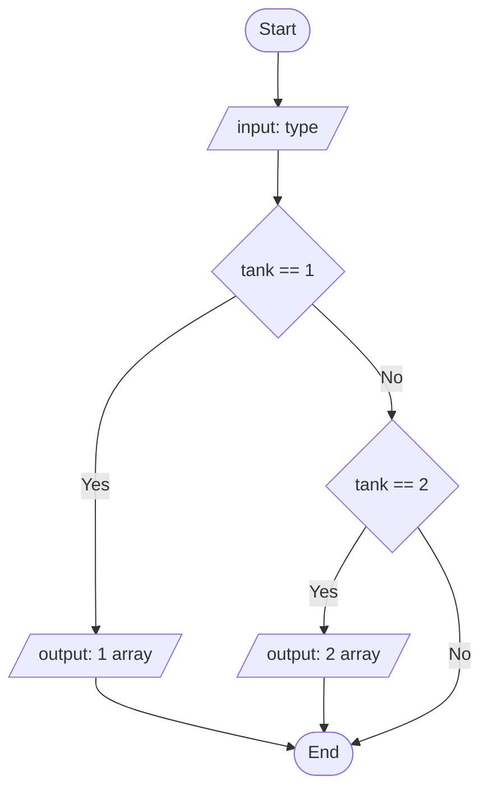

# 20230918182041 FactoryBot: Create Value Based on Other Attr Value Condition

#Rails #FactoryBot

Skenarionya, saya punya factories untuk aircraft specification dengan nama `:spec_aircraft`. Yang memiliki attribute: `tank:integer` dan `tank_capacity:jsonb`.

Kriteria:



1. Apabila `:tank` bernilai 1, maka `tank_capacity` berisi 1 data array.
1. Jika `:tank` bernilai 2, maka berisi 2 data array.

```ruby
# spec/factories/spec_aircrafts.rb
FactoryBot.define do
  factory :spec_aircraft do
    tank { [1, 2].sample }
    tank_capacity do
      case tank
      when 1
        [{ name: 'Tank Capacity No. 1', capacity: rand(50..90) }]
      when 2
        [
          { name: 'Tank Capacity No. 1', capacity: rand(50..90) },
          { name: 'Tank Capacity No. 2', capacity: rand(50..90) }
        ]
      end
  end
end
```

Oke redundant statement dapat disederhanakan,

```ruby
# spec/factories/spec_aircrafts.rb
FactoryBot.define do
  factory :spec_aircraft do
    tank { [1, 2].sample }
    tank_capacity do
      capacities = (1..tank).map do |tank_number|
        { name: "Tank Capacity No. #{tank_number}", capacity: rand(50..90) }
      end
      capacities
    end
  end
end
```

Hasilnya,

```ruby
# Jika tank == 1
#<SpecAircraft:0x00007f18a4424618> {
                    :tank => 1,
           :tank_capacity => [
        [0] {
                "name" => "Tank Capacity No. 1",
            "capacity" => 81
        }
    ]
}

# Jika tank == 2
#<SpecAircraft:0x00007f18a4424618> {
                    :tank => 2,
           :tank_capacity => [
        [0] {
                "name" => "Tank Capacity No. 1",
            "capacity" => 81
        },
        [1] {
                "name" => "Tank Capacity No. 2",
            "capacity" => 65
        }
    ]
}
```

That's it!
