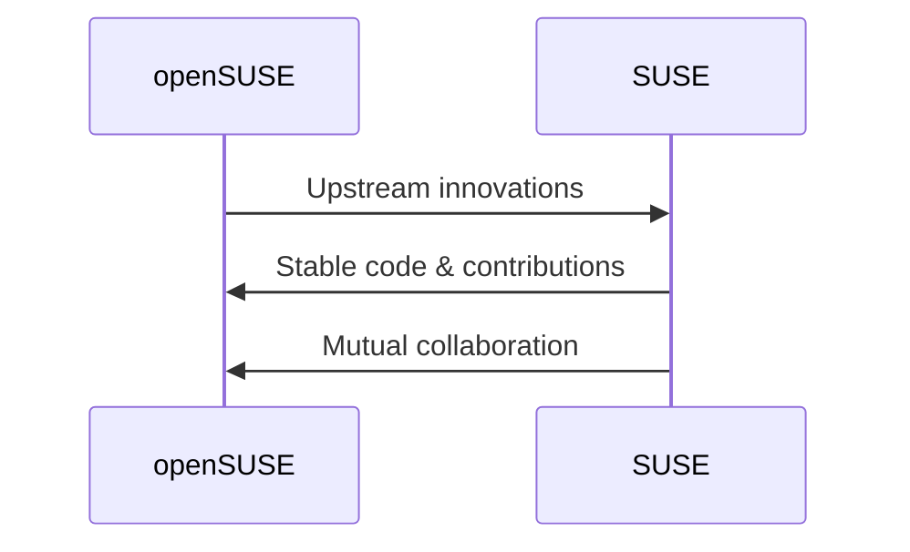

# 20230923103301 Video Note: DEV1178 Why Developers Choose openSUSE

#openSUSE

author: Neal Gompa, Richard Brown
location: SUSECON <https://youtu.be/iu-2Zrt2gHI>
date: 2019-05-21

## There was only openSUSE Linux...

* **August 9, 2005, LinuxWorld...** \
  Novell[...] announced the creation of the openSUSE project, a new initiative sponsored by Novell aimed at promoting the adoption of Linux* worldwide. [...] the project provides free and easy access to the world's most usable Linux distribution, SUSE Linux.
* **August 10, 2006...** \
  Novell's award-winning community Linux distribution, will now be known as "openSUSE", echoing the name of the Novell-sponsored open source Linux project...

## openSUSE is a hub of communities

* YaST and libyui
* Open Build Service and KIWI
* OpenQA
* Uyuni
* Kubic
* And more...

## libyui

* Part YaST installer suite
* Adopted by Mageia for the ManaTools, the successor implementation for the Mageia/Mandriva Control Center (DrakXTools)
  * Developer and maintains the libyui-mga extension modules for extra widgets to use in libyui-based applications
* Mageia's DNFDragora (part of ManaTools) has also been adopted by Fedora for various spins
* libyui's GTK 3 backend is primarily maintained by Fedorans and Mageians

## Open Build Service

* Generic build system
* Builds for wide range of Linux distributions
  * SUSE Linux Enterprise and openSUSE
  * Red Hat Enterprise Linux / CentOS
  * Fedora
  * Debian and Ubuntu
  * Arch Linux
  * And more...
* Supports building images using KIWI for RPM/DEB distributions
* Used by Wine, VideoLAN, DELL, Mer, and many others!
* Also used by many ISVs internally

## KIWI

* Generic system image builder
* Supports RPM and DEV-based distributions
  * SUSE Linux Enterprise and openSUSE
  * Red Hat Enterprise Linux / CentOS
  * Fedora
  * Debian and Ubuntu
* Packaged and available in the openSUSE, SLE, and Fedora repositories!

## OpenQA

* Automated testing framework for operating system software
* Simuates "user" for HCI testing
* Supports testing virtual machines (QEMU/libvirt) or real hardware computers (using IPMI)
* Used for testing SUSE Linux Enterprise, openSUSE, Fedora, and Red Hat Enterprise Linux
* Available in openSUSE and Fedora
* Fedora contributed FedMsg notification and containerized deployment code for OpenQA

## Uyuni

* Systems management platform -- Forked from Spacewalk
* Modernized backend and UI
* Integrates Salt master
* Integrates image creation using KIWI
* Friendly fork, Uyuni pulls fixes from Spacewal, sends relevant fixes upstream
* Basis for SUSE Managemer product

## Kubic

* openSUSE's Kubernetes distribution
* Certified Kubernetes Platform, first one certified with CRI-O
* Built on top of opneSUSE MicroOS, offering immutable server software stack and transactional updates leaveraging Btrfs features
* Represents the future of container service platforms, including SUSE CaaSP

## SUSE & openSUSE

* openSUSE is just the basis for the paid products of SLE

## Why do I choose openSUSE?

* **openSUSE Motto, "Those who do, decide"**
  * Open Source works best when decisions are made as close as possible to the actual contribution -- i.e. the volunteers doing the work
  * Self-organized teams -- those working on the same thing should work together
* **Major change: systemd**
  * Early major distribution to include systemd (March 2011)
  * Default since September 2012
  * Changes made by volunteers
    * => No major strife

## Recommendations for working in openSUSE

* Keep it simple
* Smaller is better than big
* Be clear about your goals
* Remember the basics:
  * Time zone
  * Day of week
  * Time of day
  * Holidays
  * Community type
  * Etc.
* Plan for the extra effort to be responsive and just "be there"
* There is no "us vs. them"
* Don't take disagreements personally
* Don't be disappointed, be realistic in your expectations
* Do not for active projects!
* Your business success (alone) is a bad reason for others to help you
* Do not be unclear about your business intentions (if any)
* Do not demand anything

## openSUSE - Bias for action!

* **When in doubt:**
  * DON'T WAIT, proceed directly to "do it"
* **Need help?**
  * Share with Project
    * Listen, respond, and then decide how to do it

## Primary Communication Channels

* Mailing Lists
  * <mailto:opensuse-factory@opensuse.org> - Development list
  * <mailto:opensuse-project@opensuse.org> - Project related list
  * <https://lists.opensuse.org> - Inde of more specific lists
* IRC
  * `#opensuse-factory` @irc.freenode.net - Development chat
  * `#opensuse-project` @irc.freenode.net - Project related chat
  * `#opensuse-chat`    @irc.freenode.net - Off Topic chat
  * `#opensuse-*`       @irc.freenode.net - Many more channels available

## "Those who do, decide"

* openSUSE is a hacker-centric community
  * self-organizing and self-motivating
* A large accessible network of developers and contributors
* Making improvements is as easy as submitting them
* Excellent infastructure for building new thing within the community
* Superior tools and solutions for every conceivable need
* Friendly to all folks of all stripes and types

## What are you waiting for...?

* You're all set!
* Get to work.
* Start your engines!
* Time to inconvenience some electrons with your code!
