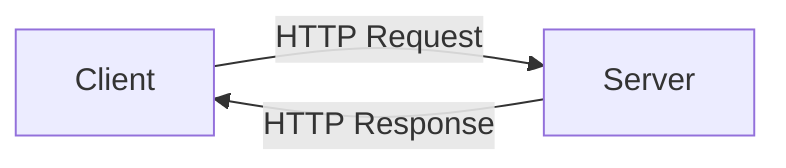
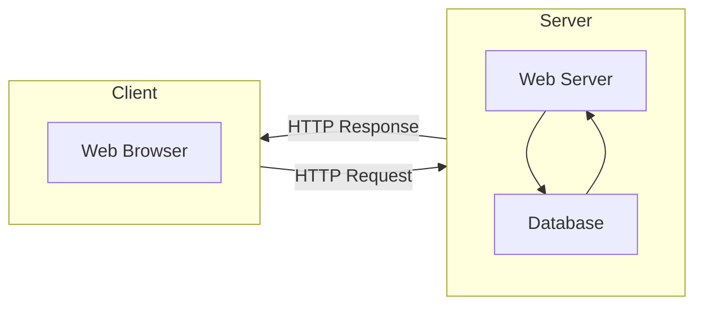
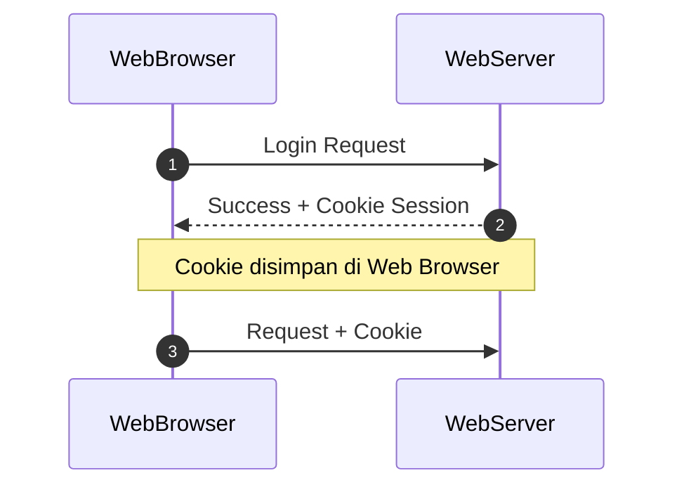
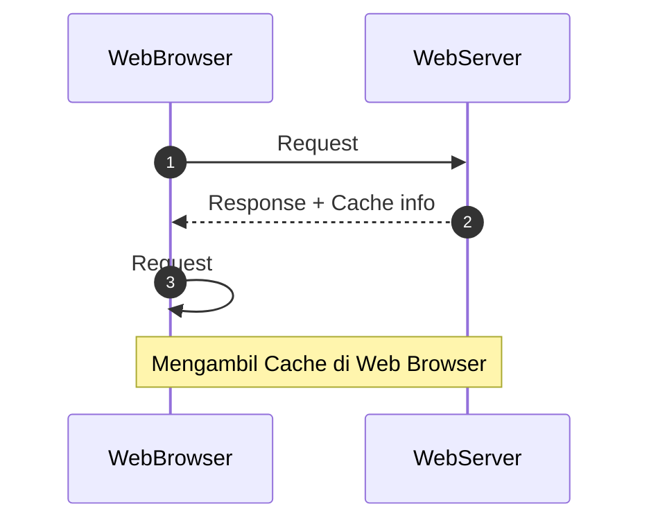

# 20231021214554 Video Note: Belajar HTTP

#HTTP

```
author: Eko Kurniawan Khannedy
location: Programmer Zaman Now <https://youtu.be/92Rjzrq4oIg>
date: 2021-07-12
```

## Agenda

* Pengenalan HTTP
* URL
* HTTP Method
* HTTP Header
* HTTP Body
* HTTP Response
* HTTP Cookie
* Dan lain-lain

## Pengenalan HTTP

* HTTP singkatan dari **Hypertext Transfer Protocol**
* HTTP merupakan protokol untuk melakukan transmisi hypermedia document, seperti HTML, JavaScript, CSS, Image, Audio, Video, dan lain-lain
* HTTP awalnya di desain untuk komunikasi antar Web Browser dan Web Server, namun saat ini sering juga digunakan untuk kebutuhan lain

### Client-Server

* HTTP mengikuti arsitektur client dan Server
* Client mengirimkan HTTP Request untuk meminta atau mengirim informasi ke server
* Dan Server membalasnya dengan HTTP Response dari HTTP Request yang diterima

### Diagram Client-Server



### Plain Language and Human Readable

HTTP didesain menggunakan bahasa yang mudah dimengerti oleh bahasa manusia, seperti:

* GET
* POST
* PUT
* DELETE
* HEAD
* OPTION

### Stateless

* HTTP merupakan protokol yang **stateless**
* Artinya tiap HTTP Request merupakan request yang independen, tidak ada keterkaitan atau hubungan dengan HTTP Request sebelum atau setelahnya
* Hal ini dilakukan agar HTTP Request tidak harus dilakukan dalam sequence, sehingga Client bisa melakukan HTTP Request secara bebas tanpa ada aturan harus dimulai dari mana

### Session

* Jika HTTP merupakan protokol yang stateless, bagaimana dengan session? Misal client harus login terlebih dahulu sebelum berinteraksi?
* Untuk menangani permasalahan ini, HTTP memiliki fitur yang bernama HTTP Cookie
* HTTP Cookie memaksa Client menyimpan informasi yang diberikan oleh Server

## HTTP Version

* Spesifikasi HTTP selalu diperbaharui
* Saat ini, kebanyakan web berjalan di HTTP/1.1 atau HTTP/2
* HTTP/2 mulai hadir sekitar tahun 2015, dan saat ini sudah banyak diadopsi oleh semua Web di Dunia

### HTTP/1.1 vs HTTP/2

* Saat ini HTTP/1.1 merupakan fallback protokol, dimana Web Browser secara default akan melakukan request menggunakan HTTP/2, jika Web Server tidak mendukung, maka Web Browser akan melakukan fallback ke protokol HTTP/1.1
* Secara garis besar, spesifikasi HTTP/2 sama dengan HTTP/1.1, yang membedakan adalah pada HTTP/2, HTTP Request yang dikirim dalam bentuk teks, secara otomatis menjadi binary, sehingga lebih cepat dibandingkan HTTP/1.1
* Selain itu di HTTP/2, menggunakan algoritma kompresi untuk memperkecil request dan mendukung multiplexing, sehingga bisa mengirim beberapa request dalam satu connection yang sama
* Dari sisi pembuatan aplikasi, tidak ada perbedaan, semua ini biasanya sudah diurus secara otomatis oleh Web Server yang kita gunakan

### HTTPS

* Secara default, HTTP tidaklah aman
* HTTPS merupakan HTTP dengan enkripsi
* Perbedaan HTTP dan HTTPS adalah, pada HTTPS menggunakan SSL (Secure Sockets Layer) untuk melakukan enkripsi HTTP Request dan HTTP Response
* Hasilnya HTTPS jauh lebih aman dibandingkan dengan HTTP biasa
* Web yang menggunakan HTTPS akan menggunakan `https://` pada URL nya, dan yang hanya menggunakan HTTP tanpa enkripsi, akan menggunakan `http://`

## HTTP Terminology

* Saat kita berlajar HTTP, ada banyak sekali menggunakan terminologi, istilah atau teknologi
* Dan kita perlu mengerti tentang hal tersebut

### Web Browser

* Merupakan aplikasi yang digunakan untuk mengakses Web menggunakan protokol HTTP
* Contohnya palikasi Google Chrome, Firefox, Opera, Safari, dan lain-lain

### TCP

* TCP singkatan dari **Tansmission Control Protocol**, adalah salah satu protokol dalam jaringan komputer yang biasa digunakan oleh web, email, FTP, atau lainnya
* Jika kita menggunakan jaringan internet, kemungkinan besar kita akan menggunakan protokol TCP untuk melakukan koneksi jaringannya

### IP

* IP singkatan dari **Internet Protocol**
* IP digunakan sebagai identitas komputer di jaringan
* Setiap komputer baik itu client dan server akan memiliki IP
* Untuk mengecek IP jaringan kita di internet, contohnya kita bisa mengakses web <https://whatismyipaddress.com>

### URL

* URL singkatan dari **Uniform Resource Locator**
* URL merupakan alamat dari sebuah resource di Web

### DNS

* DNS singkatan dari **Domain Name Server**
* DNS merupakan tempat yang berisi data katalog pemetaan antara nama domain di URL menuju lokasi IP komputer
* Saat Web Browser mengakses sebuah domain di web, sebenarnya prosesnya akan bertanya ke DNS untuk mendapatkan IP, lalu Web Browser akan melakukan request ke IP tersebut
* Untuk mengecek IP sebuah domain, kita bisa gunakan website <https://whatismyip.com/dns-lookup>

### Web Server

* Web Server merupakan aplikasi yang berjalan di jaringan Internet yang betugas sebagai server
* Web Server berisi informasi dan data yang bisa diakses oleh client
* Web Server akan menerima request dari client, dan membalas request tersebut berupa informasi yang diminta oleh client

## HTTP Flow

* Bagaimana alur kerja HTTP?
* Dalam HTTP, biasanya terdapat dua pihak yang terlibat, yaitu Client dan Server
* Client akan mengirimkan Request
* dan Server akan menerima Request dan membalas dengan Response

### Server

* Server merupakan sebuah komputer, dimana semua informasi disimpan pada komputer tersebut
* Komputer server biasanya menjalankan aplikasi Web Server agar bisa menerima protocol HTTP

### Client

* Client merupakan komputer yang bertugas mengirim HTTP Request ke komputer server
* Untuk mengirim request HTTP, biasanya client akan menggunakan plikasi Web Browser
* Client dan Server harus terkoneksi dalam jaringan yang sama, agar bisa berkomunikasi
* Misal saja, client dan server terhubung dalam jaringan internet

### Request

* Client akan mengirim request ke Server dalam bentuk HTTP Request
* HTTP Request berisikan informasi seperti lokasi resource, data yang dikirim jika ada, dan lain-lain
* HTTP Request akan diterima oleh Server
* Selanjutnya Server akan memproses request yang diminta oleh Client tersebut

### Reponse

* Setelah Server memproses HTTP Request yang dikirimkan oleh Client
* Server akan membalas dengan HTTP Response
* HTTP Response biasanya berisikan data yang diminta oleh Client dalam HTTP Request

### Digaram HTTP Flow



## Browser Network Tool

* Untuk leboh mempermudah melihat apa yang dilakukan di belakang Web Browser, biasanya Web Browser memiliki firtur Network Tool
* Contohnya di browser seperti Google Chrome dan Firefox sudah memiliki Network Tool
* Dengan Network Tool, kita bisa melihat semua detail HTTP Request dan HTTP Response yang dilakukan oleh Client dan Server

## HTTP Request dan Response

### HTTP Message

* HTTP Request dan HTTP Response, sebenarnya adalah sebuah HTTP Message
* HTTP Message memiliki standarisasi format
* Dengan demikian, jika kita ingin membuat CLient dan Server sendiri, sebenarnya bisa kita lakukan, asal kita mengikuti standarisasi format HTTP Message

### HTTP Message untuk Request

```
(1) POST /login HTTP/1.1
(2) Host: example.com
(2) Connection: keep-alive
(2) accept: application/json
(2) User-Agent: Mozilla/5.0 (Macintosh; Intel Mac OS X 10_15_7)
(2) Content-Type: application/json
(2) Content-Length: 51
(3)
(4) {"password":"rahasia","username":"khannedy"}
```

Legend:

```
(1) Start Line (HTTP Method | Context Path | HTTP Version)
(2) Headers
(3) Space
(4) Body
```

### HTTP Message untuk Response

```
(1) HTTP/1.1 200
(2) Set-Cookie: X-COMMERCE-SESSION=eyJ0eXAi0iJKV1QiLCJhbGci0iJIUzI1
(2) Content-Type: application/json
(2) Transfer-Encoding: chunked
(2) Date: Sun, 04 Jul 2021 12:17:55 GMT
(2) Keep-Alive: timeout=60
(2) Connection: keep-alive
(3)
(4) {"status":"OK","code":200,"data"{"username":"khannedy","name":"khannedy"}}
```

Legend:

```
(1) Start Line (HTTP Version | Status Code)
(2) Headers
(3) Space
(4) Body
```

## HTTP Method

* Dalam HTTP Request, hal yang pertama kita perlu tentukan adalah HTTP Method
* HTTP Method mirip seperti kategori request
* Ada banyak HTTP Method yang dapat kita gunakan ketika membuat HTTP Request, dan kita bisa sesuaikan sesuai dengan kebutuhan yang kita inginkan

### Jenis HTTP Method

| HTTP Method | Keterangan                                                            |
|-------------|-----------------------------------------------------------------------|
| GET         | GET method digunakan untuk melakukan request data.                    |
|             | Request menggunakan GET hanya untuk menerima data, bukan untuk        |
|             | mengirim data                                                         |
| HEAD        | HEAD method digunakan sama seperti dengan GET, tapi tanpa             |
|             | membutuhkan response body                                             |
| POST        | POST method digunakan untuk mengirimkan data ke Server.               |
|             | Biasanya POST digunakan untuk mengirim data baru sehingga biasanya    |
|             | memiliki request body                                                 |
| PUT         | PUT method digunakan untuk mengganti semua data yang terdapat         |
|             | di Server dengan data baru yang dikirim di request                    |
| PATCH       | PATCH method digunakan untuk mengubah sebagian data                   |
| DELETE      | DELETE method digunakan untuk menghapus data                          |
| OPTIONS     | OPTIONS method digunakan untuk mendeskripsikan opsi komunikasi        |
|             | yang tersedia                                                         |
| TRACE       | TRACE method merupakan request method untuk debugging.                |
|             | Response TRACE method akan mengembalikan seluruh informasi yang       |
|             | dikirim oleh Client. Saat membuat web, sangat direkomendasikan        |
|             | untuk tidak mengaktifkan TRACE method ketika sudah live di production |

## URL

* URL singkatan dari **Uniform Resource Locator**
* URL merupakan alamat dari sebuah resource di Web
* URL wajib kita gunakan untuk menuju informasi resource yang akan kita tuju dalam Web
* Tanpa URL, Client atau Server tidak akan mengerti informasi apa yang ingin kita cari

### Anatomi URL

* URL terdiri dari beberapa bagian
* Beberapa bagian wajib ada, beberapa bagian tidak wajib ada
* Berikut adalah contoh URL:
  * <https://www.programmerzamannow.com/>
  * <https://www.programmerzamannow.com/premium-membership/>
  * <https://www.programmerzamannow.com/?search=java>

### Schema

* Bagian awal di URL adalah **schema** yang mengindikasikan protocol yang perlu digunakan oleh Client
* Biasanya dalam URL website, schema protocol tersebut adalah **http** dan **https**

```
[http]://www.example.com/path/to/file.html?key1=value1&key2=value2#SomewhereInTheDocument
|
`--> Scheme
```

### Authority

* Selanjutnya dipisahkan dengan tanda `://` diikuti dengan Authority, yang terdiri dari **Nama Domain** dan **Nomor Port** yang dipisah menggunakan titik dua
* Nama domain nanti akan ditanyakan ke DNS untuk mendapatkan alamat IP nya
* Namun kita juga bisa langsung menggunakan IP jika memang website tersebut tidak memiliki nama domain
* Nomor port tidak wajib, tanpa nomor port, secara default bernilai 80 untuk http, dan 443 untuk https

```
http://[www.example.com]:[80]/path/to/file.html?key1=value1&key2=value2#SomewhereInTheDocument
       |                 |
       `--> Domain Name  `--> Port
```

### Path

* Selanjutnya setelah Authority, bagian selanjutnya adalah tidak wajib, yaitu **Path**
* Ada juga yang menyebut sebagai **Context Path**
* Path biasanya berisikan informasi menuju ke resource yang kita tuju
* Path terlihat seperti kumpulan folder yang diakhiri dengan file yang ingin kita akses

```
http://www.example.com:80[/path/to/file.html]?key1=value1&key2=value2#SomewhereInTheDocument
                         |
                         `--> Path to resource
```

### Parameters

* Selanjutnya, dalam URL juga bisa terdapat informasi **Parameters**, namun ini tidak wajib
* Parameter dipisah oleh karakter `?` setelah **Authority** atau **Path**
* Parameter merupakan informasi tambahan yang berisi `key=value`, jika ingin menambahkan lebih dari satu parameter, kita bisa tambahkan parameter dengan menggunakan karakter `&`

```
http://www.example.com:80/path/to/file.html[?key1=value1&key2=value2]#SomewhereInTheDocument
                                           |
                                           `--> Parameters
```

### Anchor

* Anchor merupakan bagian yang tidak wajib di URL
* Anchor merupakan representasi bookmark dalam sebuah halaman website
* Misal, jika dalam website terdapat banyak sekali bagian informasi, kita bisa gunakan anchor sebagai bookmark ke tiap bagian informasi tersebut agar lebih mudah diakses

```
http://www.example.com:80/path/to/file.html?key1=value1&key2=value2[#SomewhereInTheDocument]
                                                                   |
                                                                   `--> Anchor
```

## HTTP Header

* HTTP Header merupakan informasi tambahan yang biasa dikirim di Request atau Response
* HTTP Header biasanya digunakan agar informasi tidak harus dikirim melalui Request Body atau Response Body
* HTTP Header berisi `key: value`, dan saat ini sudah banyak sekali standarisasi nama key pada HTTP Header
* <https://en.wikipedia.org/wiki/List_of_HTTP_header_fields>

### Contoh HTTP Header

| HTTP Header   | Keterangan                                                |
|---------------|-----------------------------------------------------------|
| Host          | Authority pada URL (wajib sejak versi HTTP/1.1)           |
| Content-Type  | Tipe data dari HTTP Body                                  |
| User-Agent    | Informasi user agent (seperti Browser dan Sistem Operasi) |
| Accept        | Tipe data yang ditermia oleh Client                       |
| Authorization | Credential untuk autentikasi (misal username + password)  |

## HTTP Status

* HTTP Status merupakan kode HTTP Response yang mengidikasikan apakah sebuah request yang diterima Server sukses, gagal, atau ada hal lain yang harus diketahui oleh Client
* HTTP Status diklasifikasikan dalam lima group, yaitu:
  * (100-199) Informational Response
  * (200-299) Successful Response
  * (300-399) Redirect
  * (400-499) Client Error
  * (500-599) Server Error
* <https://en.wikipedia.org/wiki/List_of_HTTP_status_codes>

### (100-199) Informational Response

* Informational Response mengindikasikan bahwa request telah diterima dan dimengerti
* Namun Client diminta untuk menunggu tahapan akhir response
* Pada kenyataannya, Informational Response sangat jarang sekali digunakan
* <https://developer.mozilla.org/en-US/docs/Web/HTTP/Status#information_responses>

### (200-299) Successful Response

* Successful Response merupakan kode yang mengidikasikan bahwa request yang diterima oleh Client telah diterima, dimengerti, dan sukses diproses oleh Server
* <https://developer.mozilla.org/en-US/docs/Web/HTTP/Status#successful_responses>

### (300-399) Redirect

* Redirect status code mengindikasikan bahwa Client harus melakukan aksi selanjutnya untuk menyelesaikan request
* Biasanya redirect status code digunakan ketika lokasi sebuah resource berubah, sehingga Server meminta Client berpindah ke URL lain
* <https://developer.mozilla.org/en-US/docs/Web/HTTP/Status#redirection_messages>

### (400-499) Client Error

* Client error status code merupakan indikasi bahwa request yang dikirim oleh Client tidak diterima oleh server dikarenakan request yang dikirim dianggap tidak valid
* Contohnya Client mengirim body yang salah, CLient melakukan request ke tanpa autentikasi di resource yang mewajibkan autentikasi, dan lain-lain
* <https://developer.mozilla.org/en-US/docs/Web/HTTP/Status#client_error_responses>

### (500-599) Server Error

* Server error status code mengindikasikan bahwa terjadi kesalahan di Server
* Biasanya ini terjadi ketika ada masalah di Server, seperti misalnya tidak bisa terkoneksi ke basis data, terdapat jaringan error di server, dan lain-lain
* <https://developer.mozilla.org/en-US/docs/Web/HTTP/Status#server_error_responses>

## HTTP Body

* HTTP Body merupakan data yang bisa dikirim di HTTP Request, atau data yang diterima dari HTTP Response
* Artinya Client bisa mengirim data ke Server menggunakan HTTP Body, begitu juga sebaliknya
* Server bisa memberikan body di response menggunakan HTTP Body

### Content-Type

* HTTP Body erat kaitannya dengan Header key **Content-Type**
* Biasanya agar Client dan Server mudah mengerti isi HTTP Body, HTTP Message akan memiliki Header Content-Type, yang berisi informasi tipe data HTTP Body
* HTTP Body bisa berisikan teks (html, javascript, css, json) atau binary (image, video, audio)
* Data Content-Type sudah memiliki standarisasi, misal nya bisa kita lihat di link berikut:
  <https://developer.mozilla.org/en-US/docs/Web/HTTP/Basics_of_HTTP/MIME_types/Common_types>

## Redirect

* Seperti yang sudah dijelaskan pada materi HTTP Status, untuk memaksa Client melakukan redirect ke halaman lain, kita bisa menggunakan http redirect status code (300-399)
* Lantas pertanyaannya, dari mana Client tahu, harus melakukan redirect ke URL mana?
* Oleh karena itu, biasanya response HTTP Status redirect, selalu dibarengi dengan informasi URL redirectnya, dan itu disimpan pada header `Location`

### Contoh HTTP Response Redirect

Redirect ke domain yang sama,

```
HTTP/1.1 301
Location: /dashboard
```

Redirect ke domain yang berbeda,

```
HTTP/1.1 301
Location: https://www.example.com
```

## HTTP Cookie

### Stateless

* HTTP didesain stateless, artinya tiap request yang dilakukan, dia tidak tahu request sebelumnya atau selanjutnya yang akan dilakukan
* Lantas pertanyaannya, bagaimana Server tahu, kalau Client sudah login sebelum mengakses halaman tertentu?
* Hal ini, biasanya menggunakan fitur HTTP Cookie

### HTTP Cookie

* HTTP Cookie merupakan informasi yang diberikan oleh Server, dan Client secara otomatis akan menyimpan data tersebut
* Contohnya di Web Browser, ketika Web Browser melakukan request selanjutnya, maka Web Browser akan menyisipkan cookie yang sudah diterima di request sebelumnya
* Dari cookie tersebut, Server bisa mengetahui apakah request tersebut merupakan request client yang sudah login atau belum

### Contoh Penggunaan HTTP Cookie



### Cookie di HTTP Response

* Informasi cookie yang diberikan dari Server, ditempatkan pada Header dengan value `Set-Cookie`
* Cookie bisa lebih dari satu, jika Server memberikan lebih dari satu cookie, bisa menggunakan beberapa key `Set-Cookie` di Header

```
HTTP/1.1 200
Set-Cookie: user=eko
Set-Cookie: session=3412414123123121234123
```

### Cookie di HTTP Request

* Setelah cookie dari HTTP Response diterima oleh Web Browser, maka akan disimpan di Web Browser
* Selanjutnya HTTP Request selanjutnya akan mengirim cookie di tiap request, dimana cookie yang dikirim bisa menggunakan Header dengan nama `Cookie`
* Berbeda dengan HTTP Response, untuk HTTP Request, Cookie harus digabung di satu header jika lebih dari satu Cookie

### Contoh Cookie di HTTP Request

```
GET /dashboard HTTP/1.1
Host: example.com
Accept: text/html
Cookie: user=eko; session=3412414123123121234123
```

### Cookie Attributes

* Cookie memiliki attribut yang bisa ditambahkan ketika membuat cookie di HTTP Response
* Seperti masa berlaku cookie, apakah harus https, apakah tidak boleh diakses via script, dan lain-lain
* <https://developer.mozilla.org/en-US/docs/Web/HTTP/Headers/Set-Cookie>

## HTTP Caching

* HTTP memiliki fitur yang bernama caching
* Caching adalah menyimpan data di Client sampai batas waktu yang sudah ditentukan, sehingga jika Client ingin melakukan request resource yang sama, cukup ambil resource nya di Client, tanpa harus meminta ulang ke Server
* HTTP Caching sangat cocok dilakukan untuk resource file static yang jarang berubah, seperti file gambar, audio, video, dan lain-lain

### Diagram HTTP Caching



### Header Cache Control

* Server ketika meminta agar Client melakukan caching, maka HTTP Response perlu menambahkan informasi `Cache-Control` di Header
* Cache-Control berisi informasi seperti berapa lama Client bisa menyimpan data response tersebut, sehingga tidak perlu meminta ulang ke Server
* <https://developer.mozilla.org/en-US/docs/Web/HTTP/Headers/Cache-Control>

## Teknologi Lainnya

* Server-Sent Event
* WebSocket
* Cross-Origin Resource Sharing
* RESTful API
* OAuth
