# 20231126204229 Video Note: Belajar RESTful API

#HTTP

```
author: Eko Kurniawan Khannedy
location: Programmer Zaman Now <https://www.youtube.com/watch?v=9ed3b0tSRvI>
date: 2021-07-24
```

## 01 Integrasi Aplikasi

* Saat membuat aplikasi, sering sekali kita akan melakukan integrasi dengan aplikasi lain
* Baik itu aplikasi yang kita buat sendiri, ataupun aplikasi yang dibuat oleh pihak lain, misal:
  * Saat kita membuat toko online, sistem akan terintegrasi dengan sistem logistic untuk mengelola pengiriman barangnya
  * Saat kita membuat aplikasi belajar online, sistem akan terintegrasi dengan payment gateway untuk menyediakan layanan pembayaran kelas online
  * Saat kita membuat aplikasi mobile, aplikasi kita akan terintegrasi dengan sistem kita yang terdapat di server untuk mengirim atau mengambil data

### Cara Integrasi Aplikasi

Secara garis besar, terdapat 4 cara integrasi antar aplikasi, yaitu:

* File Sharing
* Database Sharing
* Remote Procedure Invocation
* Messaging

#### File Sharing

* File Sharing merupakan integrasi aplikasi dengan cara berbagi file
* Integrasi menggunakan file sharing adalah integrasi yang paling mudah dilakukan dan masih banyak dilakukan sampai sekarang
* Biasanya aplikasi yang memiliki data akan membuat file (misal: excel, csv, text, json), dan aplikasi yang membutuhkan data akan membaca data tersebut dari file
* File Sharing sangat bermanfaat ketika integrasi dilakukan antar aplikasi yang tidak terhubung secara langsung


#### Database Sharing

* Database Saring merupakan integrasi antar aplikasi yang memanfaatkan database untuk berbagi data
* Database Sharing sangat mudah dilakukan ketika aplikasi berada di tempat yang sama dan bisa mengakses database yang sama
* Aplikasi hanya perlu menyimpan data ke database, dan secara otomatis aplikasi lain bisa membaca data tersebut dari database secara langsung


#### Remote Procedure Invocation (Remote Procedure Call)

* Remote Procedure Invocation merupakan mekanisme integrasi antar aplikasi dengan cara membuat API yang bisa digunakan oleh aplikasi lain
* Aplikasi yang memiliki data akan membuat API, dan aplikasi yang membutuhkan akan menggunakan API tersebut untuk mendapatkan data dari aplikasi tersebut
* Remote Procedure Invocation merupakan cara sulit, namun sangat populer dilakukan saat ini
* Hal ini karena menggunakan Remote Procedure Invocation, integrasi bisa dilakukan dengan cara real time, dan kompleksitas internal data aplikasi tidak perlu di ekspose ke aplikasi lain


#### Messaging

* Messaging merupakan cara integrasi aplikasi yang memanfaatkan aplikasi message broker atau message bus
* Aplikasi yang memiliki data akan mengirim data ke aplikasi message broker, dan aplikasi yang membutuhkan data akan mengambil data dari message broker
* Messaging sekilar mirip dengan Remote Procedure Invocation, namun yang membedakan adalah, Messaging tidak real time, kadang butuh waktu sampai data sampai ke aplikasi yang menerima data, sederhananya proses di Messaging adalah **Asynchronous**, sedangkan proses di Remote Procedure Invocation adalah **Synchronous**


## 02 Pengenalan API

### Application Programming Interface

* API singkatan dari Application Programming Interface
* API adalah perantara yang menghubungkan satu pihak dengan pihak lain agar bisa saling berkomunikasi
* API berisi kumpulan prosefur, fungsi, cara berkomunikasi atau peralatan untuk komunikasi
* Pihak yang terlibat dalam API bisa dalam bentuk perangkat lunak atau pun perangkat keras
* API sebenarnya sama dengan Remote Procedure Invocation, hanya saja sekarang lebih populer istilah API dibandingkan RPI

### Diagram API


### Contoh Penggunaan API

* Saat kita menggunakan sistem operasi, sistem operasi tidak bisa langsung berkomunikasi dengan perangkat keras, sistem operasi membutuhkan API berupa driver yang perlu dipasang terlebih dahulu agar perangkat keras bisa terdeteksi oleh sistem operasi
* Saat kita ingin berkomunikasi dengan aplikasi Facebook, kita membutuhkan API dari Facebook agar aplikasi kita bisa berinteraksi dengan aplikasi Facebook
* Dan lain-lain

### Contoh Implementasi API

Ada banyak sekali implemenetasi API yang terdapat di dunia nyata ketika kita membuat aplikasi, misalnya:

* Driver Perangkat Keras, sebagai API untuk sistem operasi
* SOAP (Simple Object Access Protocol)
* CORBA (Common Object Request Broker Architecture)
* RESTful API
* Apache Thrift (Facebook)
* Protocol Buffer (Google)
* GRPC (Google)
* Dan lain-lain


## 03 Pengenalan RESTful API

* REST singkatan dari REpresentational State Transfer
* REST dikenalkan tahun 2000 oleh Roy Fielding dalam disertasinya:
  <https://www.ics.uci.edu/~fielding/pubs/dissertation/rest_arch_style.htm>
* RESTful API merupakan salah satu implementasi API yang memanfaatkan HTTP sebagai protokol komunikasinya
* Walaupun SOAP juga berjalan di atas HTTP, namun RESTful API sangat sederhana dibandingkan SOAP
* RESTful API sangat mudah digunakan, dan bisa diadaptasi di semua bahasa pemrograman secara mudah
* Saat ini RESTful API sudah menjadi standard API yang banyak digunakan ketika kita membuat sistem yang butuh menyediakan API untuk pihak lain

### Diagram RESTful API


### Kenapa RESTful API?

* Menggunakan HTTP sebagai protokol komunikasi, dimana sudah sangat populer saat ini dengan banyaknya pengguna Internet
* Pembuatan RESTful API sangat mudah karena seperti membuat web pada umumnya
* Mudah digunakan oleh client, baik itu berupa aplikasi web ataupun aplikasi non web seperti aplikasi desktop atau aplikasi mobile
* Ringan dan mudah dimengerti oleh manusia


## 04 Architectural Constraint

* REST (REpresentational State Transfer) merupakan architecture pattern yang dikenalkan oleh Roy Fielding tahun 2000
* REST di desain berjalan menggunakan HTTP, dan sering digunakan sebagai Web Services
* Roy Fielding memperkenalkan beberapa design principal ketika kita akan membuat REST

### Architectural Constrains

Berikut adalah beberapa design principal agar web services benar-benar sesuai dengan RESTful API

* Client-Server
* Stateless
* Cacheable
* Uniform interface
* Layered system
* Code on demand

#### Client-Server

* Design principal pertama adalah Client-Server
* RESTful API haruslah memisahkan antara kompleksitas data internal dengan yang akan diekspose ke client
* Oleh karena itu, RESTful API haruslah menggunakan arsitektur Client-Server, sehingga Client tidak perlu tahun kompleksitas logic yang terjadi di Server


#### Stateless

* Interaksi antar Client dan Server dalam RESTful haruslah stateless
* Artinya tiap interaksi harus tidak tergantung dengan interaksi sebelumnya atau setelahnya, dan setiap interaksi harus mengirim seluruh informasi yang dibutuhkan
* Ini mirip dengan stateless di protocol HTTP
* Salah satu kegunaan stateless adalah sehingga mudah untuk di scalling, baik itu jumlah Client juga Server karena Server atau Client tidak perlu peduli harus berinteraksi dengan Client atau Server manapun


#### Cacheable

* Untuk menghemat komunikasi, RESTful API bisa mengimplementasikan Cache
* Mirip seperti Cache di HTTP, di Client pada RESTful API juga bisa melakukan cache data di local, sehingga tidak perlu selalu meminta data terbaru dari Server
* Cara implementasi Cache di RESTful API tidak sesederhana seperti di HTTP, nanti akan kita bahas di materi tersendiri tentang Cache

```mermaid
flowchart LR
  A["Client 📦"] --> D["Server 📦"]
  B["Client 📦"] --> D
  C["Client 📦"] --> D
```



#### Uniform Interface

* Salah satu yang membedakan RESTful API dengan teknologi RPC (Remote Procedure Call/Invocation) lainnya adalah, penggunaan antarmuka komunikasi yang seragam untuk semua pihal (Client & Server teknologi apapun)
* Hal ini dikarenakan salah satunya karena RESTful API menggunakan teknologi HTTP yang sudah standard sehingga seragam di semua teknologi atau bahasa pemrograman
* Data yang di ekspose di RESTful API juga haruslah generated, tidak memperlihatkan kompleksitas internal dari pemilik data, hal ini membuat perubahan apapun yang terjadi pada internal aplikasi, tidak akan berpengaru dengan data yang di ekspose di API

```mermaid
flowchart LR
  A["Client 📦🍙"] --> D["Server 📦🍙🍣🍚"]
  B["Client 📦🍙"] --> D
  C["Client 📦🍙"] --> D
```



#### Layered System

* Untuk melakukan improvement pada sistem RESTful API, sistem RESTful API juga dapat menggunakan Layered System
* Layered System menjadikan sistem bisa disusun sesuai dengan data nya, dan agar kompleksitas pada RESTful API tidka harus diketahui oleh Client
* Layer juga bisa digunakan untuk melakukan enkapsulasi aplikasi lama yang tidak memiliki kemampuan RESTful API, atau menjadi load balancer untuk RESTful API lain

```mermaid
flowchart LR
  A["Client 📦🍙"] --> D["Server 📦🍙"]
  B["Client 📦🍙"] --> D
  C["Client 📦🍙"] --> D
  D --> E["Server 📦🍣"]
  D --> F["Server 📦🍚"]
```



#### Code on Demand

* RESTful API juga diperbolehkan mengembalikan script yang bisa dieksekusi oleh client jika diperlukan
* Hal ini bisa mempermudah dari sisi Client sehingga tidak perlu mengimplementasikan kode terlalu banyak, karena kode bisa dikirim oleh Server
* Misal Server memngembalikan kode JavaScript yang akan dieksekusi oleh Client Web, atau mengembalikan Layout XML untuk di render oleh aplikasi Android
* Code on Demand adalah design principal yang tidak wajib diimplementasikan ketika kita membuat RESTful API

### Perhatian

* Design principal ini adalah panduan jika kita ingin membuat RESTful API yang baik
* Namun pada kenyataannya, kadang kita melakukan hal-hal yang tidak sesuai dengan design principal
* Walaupun masih tetap kita membuat RESTful API, namun kemungkinan RESTful API kita tidak bisa dibilang "truly RESTful API"


## 05 Resource Naming

* Banyak orang yang asal dalam pembuatan URL untuk RESTful API
* Walaupun pembuatan URL RESTful API sendiri tidak ada standard baku nya, namun langkah baiknya mengikuti best practice yang ada

### Resource

* Resource dalam RESTful API adalah data yang sifatnya bisa satu atau banyak
* Misal, "customers" adalah kumpulan dari "customer", dimana "customer" adalah satu data customer

### Gunakan Kata Benda, Bukan Kata Kerja

Contoh Benar:

* http://api.example.com/products
* http://api.example.com/members

Contoh Salah:

* http://api.example.com/get-all-products
* http://api.example.com/select-members-table

### Gunakan Hirarki

Contoh Benar:

* http://api.example.com/products/{product_id}/images
* http://api.example.com/merchants/{merchant_id}/addresses

Contoh Salah:

* http://api.example.com/product-images/{product_id}
* http://api.example.com/merchant-addresses/{merchant_id}

### Gunakan Action Pada Resource

Contoh Benar:

* http://api.example.com/users/login
* http://api.example.com/users/forget-password

Contoh Salah:

* http://api.example.com/login-user
* http://api.example.com/forget-password-user

### Gunakan - dan lowercase

Contoh Benar:

* http://api.example.com/products/{product_id}/warehouse-locations

Contoh Salah:

* http://api.example.com/products/{product_id}/warehouse_locations
* http://api.example.com/products/{product_id}/warehouseLocations

### Gunakan CRUD pada HTTP Method

Contoh Benar:

* GET  http://api.example.com/products/{product_id}
* POST http://api.example.com/products

Contoh Salah:

* GET  http://api.example.com/get-products-by-id/{product_id}
* POST http://api.example.com/create-products

### Gunakan Query Parameter untuk Filter

Contoh Benar:

* http://api.example.com/products?name=Indomie
* http://api.example.com/products?name=Indomie&page=10

Contoh Salah:

* http://api.example.com/products/filter-by-name/{name}
* http://api.example.com/products/page/1


## 06 Content Negotiation

* Saat membuat Web menggunakan HTTP, maka biasanya content (Body) yang akan kita gunakan akan menggunakan HTML
* Pada RESTful API pun, untuk berkomunikasi antara Client dan Server, biasanya menggunakan Body
* Ada banyak sekali Body Content yang biasa digunakan di RESTful API, seperti JSON (JavaScript Object Notation), XML, dan lain-lain
* Namun yang paling populer dan banyak digunakan saat ini adalah JSON

### HTTP Headers

* Sama seperti pada HTTP, untuk melakukan content negotioation, pada RESTful API akan menggunakan standard HTTP Header: `Accept` dan `Content-Type`
* `Accept` digunakan untuk memberi tahu Server, tentang tipe data yang diterima oleh Client
* dan `Content-Type` digunakan untuk memberi tahu Server, tipe data apa yang dikirim oleh Client

### JSON

* JSON singkatan dari JavaScript Object Notation
* JSON adalah tipe data object pada JavaScript
* <https://www.json.org>

Contoh JSON

```json
{
  "first_name": "Eko Kurniawan",
  "last_name": "Khannedy",
  "value": 100,
  "address": {
    "city": "Jakarta",
    "country": "Indonesia"
  },
  "url": "https://www.youtube.com/c/ProgrammerZamanNow"
}
```

### Kenapa Menggunakan JSON

* JSON sangat populer digunakan dalam pembuatan RESTful API saat ini
* Data JSON sangat mudah dibuat dan juga dimengerti oleh manusia
* JSON tidak hanya mudah dibuat dalam JavaScript, namun hampir di semua bahasa pemrograman
* Data dalam bentuk JSON sangat ringan, sehingga cocok untuk digunakan sebagai data komunikasi antara Client dan Server

### Konsisten Menggunakan JSON

* Tidak seperti SOAP yang format request dan response nya sudah ditentukan, menggunakan RESTful API tidak ada standar baku dalam membuat request dan response
* Menggunakan JSON jika tidak dibuat dengan baik bisa terlalu liar, karena memang bisa dibuat sesuka kita
* Disarankan untuk membuat standard request dan response agar tidak membingungkan ketika menggunakan RESTful API yang kita buat
* Response JSON yang dinamis akan sangat menyulitkan Client, terutama yang menggunakan bahasa pemrograman static typed

Contoh Standard JSON (Success)

```json
{
  "took": 123,
  "status": "OK",
  "data": {
    "name": "Eko",
    "address": "Indonesia"
  },
  "errors": null
}
```

Contoh Standard JSON (Failed)

```json
{
  "took": 87,
  "status": "ValidationError",
  "data": null,
  "errors": {
    "name": "is not blank",
    "address": "is not blank"
  }
}
```
### Response Status

* Selalu gunakan response status code yang sesuai dengan Standarisasi HTTP
* Misal, jika sukses, gunakan Response Status 2xx
* Jika data yang dikirim oleh client tidak valid, gunakan 4xx
* Jika terjadi masalah di Server, gunakan 5xx


## 07 Caching

### Apa itu Cache?

* Secara sederhana cache adalah data bersifat sementara yang disimpan pada sistem penyimpanan
* Dalam RESTful API, data cache biasanya disimpan di Client (misal di Web Browser, atau di Mobile App)
* Cache biasa digunakan untuk menurunkan jumlah data transfer antara Client dan Server sehingga proses komunikasi lebih cepat

Tanpa Cache


Dengan Cache


### HTTP Header Response ETag

* HTTP HEader ETag digunakan untuk menambah informasi terhadap resource yang dikembalikan di Server
* ETag berisikan versi dari resource yang diminta, misal

  ```
  ETag: "33a64df551425fcc55e4d42a148795d9f25f89d4"
  ```

### HTTP Header Request If-Not-Match

* Setelah Client menyimpan data cache, setiap Client mengirim request ke Server, Client akan menambahkan HTTP Header `If-Not-Match`
* HTTP Header If-Not-Match berisikan data ETag yang sebelumnya di dapat
* Jika data tidak berubah, maka Server akan mengembalikan HTTP Response Code 304: Not Modified

  ```
  If-None-Match: "33a64df551425fcc55e4d42a148795d9f25f89d4"
  ```


## 08 Idempotence

### Idempotent RESTful API

* Dalam RESTful API, ketika membuat multiple request yang identik, harus memiliki efek yang sama seperti membuat satu request. Dalam hal ini, maka RESTful API kita bisa dibilang **idempotent**
* Idempotent itu sangat penting, karena saat membuat RESTful API, kita akan melakukan komunikasi antara client dan server via Network, sehingga Error bisa saja terjadi
* Belum lagi, banyak framework atau library Client yang bisa secara otomatis melakukan request ulang ketika terjadi Error pada Network

### Implementasi Idempotent di RESTful API

* Saat implementasi RESTful API sesuai kaidah HTTP Method yang standar, secara otomatis sebenarnya kita sudah melakukan proses idempotent

#### Idempotent di HTTP Method POST

* Umumnya, pada POST, kita tidak perlu membuat API nya menjadi idempotent. Request berkali-kali menggunakan POST dengan data yang sama akan selalu membuat record baru
* Namun, kadang hal ini berbahaya, misal ketika terjadi kesalahan Client mengirim dua data yang sama, maka akan menjadi 2 record di Server, padahal awalnya hanya ingin membuat 1 record
* Hal ini bisa diselesaikan dengan trik ID record baru dikirim dari Client, tidak menggunakan auto generate atau auto increment. Dengan demikian, jika Server menerima POST untuk membuat record baru, Server bisa mengecek apakah data pernah dibuat, jika pernah dibuat, request selanjutnya bisa di hiraukan, atau dijadikan proses update
* Namun, perlu diingat, ini opsional, pada POST implementasi idempotent tidak diwajibkan

### Idempotent di HTTP Method GET

* Method GET tidak pernah mengubah data di Server. Method GET hanya digunakan untuk mengambil data yang ada di Server
* Jadi, mengirim request GET berkali-kali ke Server tidak akan mengubah data apapun di Server, sehingga GET secara default sudah idempotent

## Idempotent di HTTP Method PUT & PATCH

* Method PUT & PATCH digunakan untuk mengubah data yang sudah ada
* Jika kita mengirim request PUT & PATCH berkali-kalid dengan data yang sama, maka Server akan melakukan proses update data berkali-kali dengan data yang sama
* Request pertama akan mengubah data di database, request selanjutnya hanya akan mengubah data request pertama, sehingga hasil akhirnya sebenarnya tetap sama
* Oleh karena itu PUT & PATCH bisa dibilang idemportent, karena hasil akhirnya tetap sama

## Idempotent di HTTP Method DELETE

* Method DELETE digunakan untuk menghapus data di Server
* Ketika kita mengirim perintah DELETE berkali-kali di Server, response nya mungkin akan berbeda
* Response pertama mungkin akan 200 OK atau 204 No Content. Selanjutnya request akan mengembalikan response 404 Not Found, karena datanya sudah terhapus pada request pertama
* Walaupun secara response mungkin berbeda, namun sebenarnya DELETE sudah secara default idempotent, karena mengirim request DELETE berkali-kali, hasilnya tetap sama, data yang ada di Server terhapus


## 09 Security

### Mengamankan RESTful API

* Ada kalanya kita butuh mengamankan RESTful API yang kita buat
* Atau ingin membatasi pihak yang boleh mengakses RESTful API yang kita buat
* Selah satunya adalah dengan menggunakan Authentication dan Authorization

### Authentication dan Authorization

**Authentication**:

* Memvalidasi kredensial untuk memverifikasi pemilik identitas
* Contoh proses Authentication adalah proses login menggunakan username dan password, dan banyak yang lainnya

**Authorization**:

* Authorization adalah proses yang dilakukan setelah proses Authentication
* Memvalidasi apakah pemilik identitas memiliki hak akses untuk mengakses resource yang diminta
* Contoh proses Authorization adalah Access-Control List, dan banyak yang lainnya

### Contoh Authentication & Authorization

* Basic Auth
* API-Key (Secret key)
* OAuth 2
* dan lain-lain

#### Basic Auth

* Authentication sederhana menggunakan username dan password
* Cukup menggunakan header Authorization
* <https://tools.ietf.org/html/rfc7617>

Contoh:

* Authorization: Basic base64(username:password)

#### API-Key

* Authentication sederhana menggunakan API-Key atau Secret key
* Cukup menggunakan header sesuai dengan yang diinginkan dan value berisi API-Key atau Secret key

Contoh:

* API-Key: random-api-key-urnod2i3unr8qy78n8nrf83ufior2u3fior

#### OAuth 2

* Mekanisme Authentication dan Authorization yang saat ini sangat populer
* Banyak digunakan untuk integrasi antara aplikasi Mobile dan Server
* <https://tools.ietf.org/html/rfc6749>
* <https://tools.ietf.org/html/rfc6750>

```
+----------+                                           +---------------+
|          |--(A)------- Authorization Grant --------->|               |
|          |                                           |               |
|          |<-(B)----------- Access Token -------------|               |
|          |               & Refresh Token             |               |
|          |                                           |               |
|          |                            +----------+   |               |
|          |--(C)---- Access Token ---->|          |   |               |
|          |                            |          |   |               |
|  Client  |<-(D)- Protected Resource --| Resource |   | Authorization |
|          |                            |  Server  |   |     Server    |
|          |--(E)---- Access Token ---->|          |   |               |
|          |                            |          |   |               |
|          |<-(F)- Invalid Token Error -|          |   |               |
|          |                            +----------+   |               |
|          |                                           |               |
|          |--(G)----------- Refresh Token ----------->|               |
|          |                                           |               |
|          |<-(H)----------- Access Token -------------|               |
+----------+           & Optional Refresh Token        +---------------+
```


## 10 Versioning

### Jangan Merusak RESTful API

* Saat membuat RESTful API, usahakan tidak pernah merusak kompatibilitas tiap kita melakukan upgrade
* Versioning hanya diperlukan ketika kita memang perlu merusak kompatibilitas RESTful API kita
* Namun, saya sarankan sebisa mungkin tidak pernah melakukan ini, karena cost nya sangat mahal di sisi Client, Client harus merubah aplikasi yang sudah berjalan
* Namun jika memang harus dilakukan, maka kita wajib melakukan versioning pada RESTful API kita

### Versioning

* Ada banyak cara melakukan versioning pada RESTful API
* Versioning adalah memberi tahu bahwa kita memiliki banyak versi terhadap aplikasi RESTful API kita
* Client bisa memilih versi yang mana yang akan digunakan

### Versioning pada URL

* http://api.example.com/v1/products
* http://api.example.com/v2/products
* http://api.example.com/2020/products

### Versioning menggunakan HTTP Header

* HTTP Header => API-Version: 1
* HTTP Header => API-Version: 2
* HTTP Header => X-API-Version: 2019
* HTTP Header => X-API-Version: 2020


## 11 Stateless

### Stateless RESTful API

* Stateless sederhananya adalah tidak menyimpan state atau data
* RESTful API yang baik tidak pernah menyimpan state atau data antar request
* Setiap request dari Client ke Server, harus berisikan semua informasi lengkap yang dibutuhkan oleh Server
* Client bertanggung jawab menyimpan dan melakukan manajemen state yang berhubungan dengan Client
* Stateless artinya setiap HTTP Request adalah proses independent, tidak bergantung dengan HTTP Request lainnya
* Server tidak boleh tergantung dengan request dari Client sebelumnya

### Problem Stateful RESTful API


### Menggunakan Stateless RESTful API


### Keuntungan Stateless RESTful API

* RESTful API yang stateless akan mudah di scaling secara horizontal, karena request dari Client bisa masuk ke Server mana saja, sehingga untuk scaling hanya tinggal menambah Server baru
* Sederhana, karena tidak perlu tahu state sebelumnya yang sangat kompleks
* Setiap request Client akan sangat lengkap, sehingga mudah untuk di-track dan di-check request nya


## 12 HATEOAS

* HATEOAS singkatan dari **Hypermedia as the Engine of Application State**
* Hypermedia artinya content yang memiliki link menuju resource yang ada

### Contoh HATEOAS (1)

```json
[
  {
    "id": 1,
    "name": "Eko",
    "email": "eko@example.com",
    "_lnks": {
      "self": "/customers/1"
    }
  }
]
```

### Contoh HATEOAS (2)

```json
{
  "account": "9313148",
  "balance": 100000000,
  "links": {
    "deposit": "/accounts/9313148/deposit",
    "withdraw": "/accounts/9313148/withdraw",
    "transfer": "/accounts/9313148/transfer",
    "close": "/accounts/9313148/close"
  }
}
```

### Keuntungan Menggunakan HATEOAS

* Biasanya URL API pada RESTful API sudah di hardcode di Client
* Dengan menggunakan HATEOAS, Client bisa secara dinamis mendapatkan URL lokasi resource dari response data Server


## 13 Documentation

### RESTful API Documentation

* RESTful API tidak memiliki standar baku seperti SOAP, sehingga untuk memudahkan Client dalam menggunakan RESTful API yang kita buat, sebaiknya kita menyediakan dokumentasi
* Dokumentasi RESTful API bisa dibuat menggunakan apapun, dari dokumen sederhana menggunakan Microsoft Word, Google Doc, sampai menggunakan tool khusus untuk dokumentasi API
* Sangat disarankan untuk menggunakan tool khusus dokumentasi API

### Contoh API Documentation

* Swagger <https://petstore.swagger.io/>
* Stoplight <https://stoplight.io/>
* Redoc
* dan lain-lain

### OpenAPI

* OpenAPI adalah spesifikasi yang banyak diadopsi oleh industri untuk mendeskripsikan API
* <https://www.openapis.org>
* Contoh OpenAPI: <https://github.com/OAI/OpenAPI-Specification/tree/main/examples/v3.0>

### Keuntungan Menggunakan OpenAPI

* Standard, sehingga bisa dibuat oleh programmer bahasa pemrograman apapun
* Mudah digunakan oleh Client, karena sudah banyak tersedia generator untuk melakukan generate code client dari OpenAPI Specification


## 14 Development

### Kesalahan Ketika Membuat RESTful API

* Selalu membuat CRUD API untuk table di database
* Membuat response data sama dengan table di database
* Membuat API terlebih dahulu, baru mengerjakan Web atau Mobile menggunakan API yang sudah dibuat
* Mengembalikan data selengkap-lengkapnya di API
* Membuat API yang tidak dibutuhkan oleh Client

### Tahapan Membuat RESTful API


### Contoh: RESTful API Shopping Cart: Business Flow

1. Customer menambahkan barang ke keranjang, bisa lebih dari satu barang
2. Customer membuka halaman keranjang, bisa mengubah data quantity barang
3. Customer memasukkan alamat pengiriman
4. Customer menekan tombol order untuk membuat order
5. ...

### Contoh: RESTful API Shopping Cart: Screen


### Contoh: RESTful API Shopping Cart: API Doc

* Product Detail
  * GET /products/:id
  * POST /carts

* Shopping Cart
  * GET /carts
  * PATCH /carts/products
  * PATCH /carts/products/:id

* Shipping Address
  * GET /addresses
  * POST /addresses
  * PUT /carts/addresses
  * POST /orders

* Order Detail
  * GET /orders/:id


## 15 Maintenance

* Dalam membuat produk, fitur pasti akan selalu bertambah
* Tak jarang kita mungkin melakukan perubahan di screen Web atau Mobile yang sama
* Oleh karena itu, maintenance RESful API sangatlah penting, agar RESTful API kita tidak menjadi masalah di kemudian hari

### Improvement di Client


### Maintenance: yang Boleh Dilakukan

* Menambah data baru di API yang sudah ada
* Menambah API baru di endpoint URL berbeda
* Mempercepat proses di API yang sudah ada
* Menggabungkan beberapa API menjadi satu, tanpa menghilangkan API lama

### Maintenance: yang Tidak Boleh Dilakukan

* Mengubah total response data di API yang sudah ada
* Merubah field response data di API yang sudah ada
* Menghilangkan API yang sudah ada
* Men-split API yang sudah ada menjadi dua atau lebih
* Menggabungkan beberapa API menjadi satu dengan menghapus API lama


## 16 Maturity Model

### Richardson Maturity Model

Leonard Richardson telah melakukan analisa banyak sekali Web Service, dan akhirnya menyimpulkan dalam 4 kategori, seberapa sempurna RESTful API

<https://www.crummy.com/writing/speaking/2008-QCon/act3.html>

* Level Zero
* Level One
* Level Two, dan
* Level Three

#### Level Zero

One URL, One HTTP Method

* Pada Level Zero, biasanya Web Service dibuat hanya menggunakan satu URL dan satu HTTP Method
* Contoh adalah SOAP dan XML-RPC, biasanya hanya menggunakan satu URL dan HTTP Method POST saja untuk semua API
* Jika kita masih menggunakan teknik seperti ini, artinya kita masih berada di Level Zero

#### Level One

Many URLs, One HTTP Method

* Jika kita sudah menggunakan banyak URL ketika membuat Web Service, namun masih selalu menggunaan satu HTTP Method, maka kita berada di Level One
* Biasanya Web Service versi lama masih menggunakan format seperti ini, walaupun sudah menggunakan banyak URL, namun hanya menggunakan satu HTTP Method, biasanya menggunakan POST

#### Level Two

Many URLs, Each Supporting Multiple HTTP Methods

* Ini adalah level dimana kebanyakan Web Service saat ini
* Banyak URL, dan tiap URL biasanya mendukung satu atau lebih jenis HTTP Method
* Misal URL yang sama, menggunakan GET untuk mengambil data, dan POST untuk menambah data
* Jika kita sudah melakukan hal ini, artinya kita sudah berada di Level Two

#### Level Three

Resources describe their own capabilities and interconnections

* Level Three atau paling tinggi sebenarnya mirip dengan Level Two, yang membedakan adalah pada Level Three setiap resource akan memberikan detail relasi ke resource lainnya, atau singkatnya adalah sudah mengimplementasikan HATEOAS
* Memang Level Three ini agak menyulitkan ketika diimplementasikan, dan kebanyakan programmer hanya berhenti di Level Two
* Dengan mengimplementasikan HATEOAS, kita bisa dengan mudah mendapatkan URL resource ke relasi data yang kita butuhkan


## 17 Teknologi Lainnya

* OAuth
* JWT
* OpenAPI
