# 20231226070809 Video Note: Dasar-dasar Pemrograman

#Algoritma #Pemrograman

[toc]

```
author: Study With Student (Yunus Febriansyah)
title: Dasar-dasar Pemrograman
location: <https://www.youtube.com/playlist?list=PLjRBWix725xqahfUnpBMo5LlaYjvId_2I>
date: 2019-10-09
```

Sumber: Bapak Ferico selaku dosen Pengantar Algoritma

## 01 Pengantar Algoritma

### Pengertian

* Urutan atau langkah-langkah untuk menyelesaikan masalah pemrograman komputer. \
  <https://teknojurnal.com/pengertian-algoritma-pemrograman>

### Penemu Algoritma

Muhammad Ibnu Musa al-Khwarizmi
(Al-Khwarizmi)

* Algoritma
* Aljabar

### Analogi

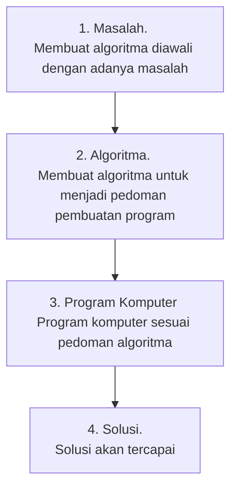

### Cara Mendeskripsikan Masalah

1. Menjabarkan masalah
1. Merinci masalah untuk menyelesaikan masalah
1. Membuat sarana interaksi manusia - komputer

### Masalah -> Program Komputer

1. Bentuk urutan masalah
1. Tentukan bahasa pemrograman
1. Konsep mesin komputer

### Kesimpulan

* Penyusunan aspek proses logika dari suatu pemecahan masalah tanpa melihat karakteristik dari bahasa pemrograman yang akan digunakan
* Urutan notasi logika yang merupakan hasil analisis dan rancangan sistematik dari strategi pemecahan masalah, untuk menggambarkan urutan langkah kerja yang jika dikerjakan akan membawa ke tujuannya
* Urutan logika langkah kerja (notasi algoritma) untuk menyelesaikan suatu masalah

### Notasi Algoritma

1. Untaian kalimat deskriptif
1. Flowchart
1. Pseudocode


## 02 Notasi Kalimat Deskriptif

### Pengertian

* Cara menuliskan instruksi-instruksi yang harus dilaksanakan dalam bentuk untaian kalimat deksriptif dengan menggunakan bahasa yang jelas

### Tips Membuat Kalimat Deskriptif

1. Bahasa baku
1. Mudah dimengerti
1. Berkoresponden dengan notasi pemrograman

### Contoh di Kehidupan

Memasak Nasi

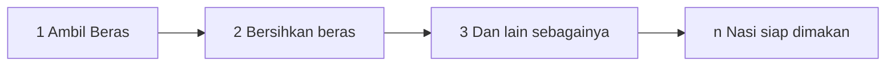

### Contoh di Pemrograman

Program Persegi Panjang \
Program untuk menghitung luas persegi panjang.

Algoritma:

1. Masukkan/input panjang dan lebar persegi panjang
1. Hitung luas persegi panjang dengan rumus `Luas = Panjang x Lebar`
1. Tampilkan luas persegi panjang


## 03 Notasi Flowchart

### Pengertian

* Cara menuliskan instruksi-instruksi yang harus dilaksanakan dalam bentuk simbol-simbol diagram alir

### Simbol/Notasi (dasar)

| Simbol               | Nama        | Fungsi                               |
|----------------------|-------------|--------------------------------------|
| (kapsul/tablet)      | Terminator  | Memulai dan mengakhiri flowchart     |
| (arrow)              | Arrow       | Arah aliran alur                     |
| (horizontal diamond) | Preparation | Inisialisasi/pemberian nilai awal    |
| (jajar genjang)      | Data        | Membaca input dan menampilkan output |
| (persegi panjang)    | Process     | Proses pengerjaan                    |

> **NOTE**: Dalam perancangan flowchart sebenarnya tidak ada rumus atau patokan yang bersifat mutlak (pasti). Hal ini didasari oleh flowchart (bagan alir) adalah sebuah gambaran dari hasil pemikiran dalam menganalisa suatu permasalahan dalam komputer

### Program Hitung Persegi Panjang

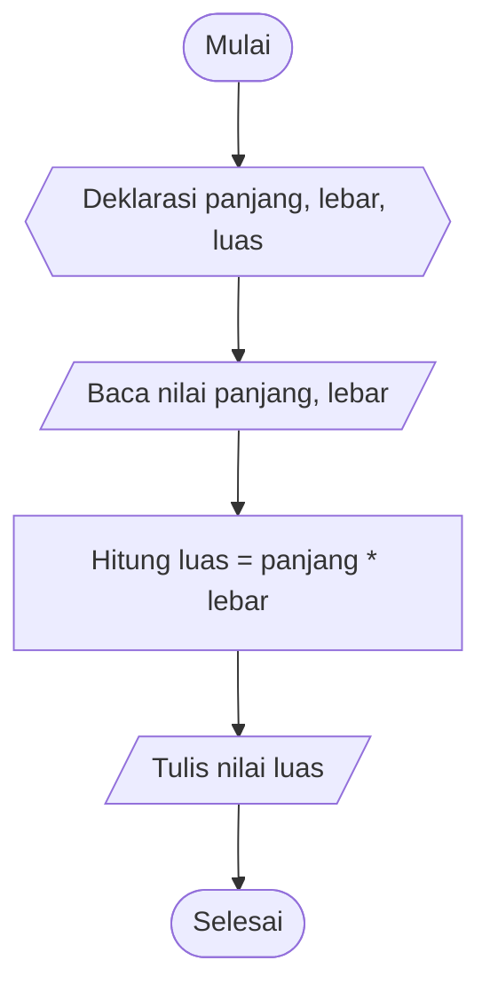

### Tips Menggunakan Flowchart

1. Pilih bahasa Indonesia atau Inggris
1. Gunakan bahasa yang baku
1. Masukkan kalimat di dalam simbol


## 04 Notasi Pseudocode

### Pengertian

* Langkah-langkah pemecahan masalah dengan menggunakan kode yang tidak terikat pada bahasa pemrograman tertentu

### Ciri-ciri Pseudocode

1. Pola bahasa Inggris yang simple
1. Tidak ada standar aturan baku

### Contoh Pseudocode

```
//PROGRAM persegi panjang
//Program untuk menghitung luas persegi panjang.

//DECLARATION
  DECLARE integer panjang, lebar, luas

//IMPLEMENTATION/DEFINITION
  INPUT (panjang, lebar)
  SET luas = panjang * lebar
  DISPLAY (luas)
```


## 05 Variabel dan Konstanta

### Pengertian

* Konstanta: Suatu elemen yang nilainya sudah ditetapkan
* Variabel: Suatu elemen yang nilainya berubah-ubah atau tidak tetap

### Konsep Variabel dan Konstanta

* Konstanta & variabel hanya menyimpan data secara sementara (Volatile/RAM)
* Nilai konstanta tidak dapat diubah selama program dijalankan, sedangkan nilai variabel dapat diubah selama program dijalankan
* Konstanta & variabel hanya dapat menyimpan satu data
* Nilai dan suatu konstanta & variabel adalah nilai yang terakhir

```
INT x
x = 10
x = 5
x = 50

DISPLAY x
50
```

### Aturan Variabel dan Konstanta

* Harus dimulai dengan huruf alfabet
* Huruf kecil atau huruf kapital dibedakan (x dan X, berbeda)
* Karakter penyusun variabel hanya boleh huruf alfabet, angka, dan garis bawah
* Tidak boleh menggunakan spasi (whitespace)
* Penamaan konstanta & variabel sebaiknya mencerminkan nilai yang dikandungnya

### Membuat Konstanta

```
CONSTANT phi = 3.14
```

### Membuat Variabel

```
DECLARE r = 30
```


## 06 Tipe Data

### Pengertian

* Digunakan untuk memrepresentasikan nilai suatu data (sesuai dengan bahasa pemrograman yang digunakan)

### Jenis Tipe Data

1. Bilangan Bulat
1. Bilangan Pecahan
1. Karakter / Teks
1. Boolean

### Bilangan Bulat

* Dipakai untuk menyatakan bilangan yang tidak mempunyai pecahan desimal, misalnya `34`, `8`, `1203`, `-7`, `432553`, dll.

| Tipe Data | Ukuran (bit) | Range                                         |
|-----------|--------------|-----------------------------------------------|
| Byte      | 8            | -128 s.d. 127                                 |
| Short     | 16           | -32768 s.d. 32767                             |
| Int       | 32           | -214683648 s.d. 2147483647                    |
| Long      | 64           | -9223372036854775808 s.d. 9223372036854775807 |

### Bilangan Pecahan
* Dipakai untuk menyatakab bilangan yang mempunyai pecahan desimal, misal `3.65`, `0.0045`, `29.0`, dll.

| Tipe Data | Ukuran (bit) | Range                         |
|-----------|--------------|-------------------------------|
| Float     | 832          | -3.4 x 1038 s.d. 3.4 x 1038   |
| Double    | 64           | -1.8 x 10308 s.d. 1.8 x 10308 |

### Karakter / Teks

* Karakter -> Dipakai untuk menyatakan simbol (angka, huruf, special character)
* Teks -> Kumpulan dari karakter

| Tipe Data | Ukuran (bit) | Range        |
|-----------|--------------|--------------|
| Char      | 16           | 0 s.d. 65535 |

### Boolean

* Dipakai untuk menyatakan nilai Benar/True/1 atau Salah/False/0

| Tipe Data | Ukuran (bit) | Range        |
|-----------|--------------|--------------|
| Boolean   | -            | True / False |


## 07 Operator

### Pengertian

* Merupakan simbol-simbol yang digunakan untuk operasi data tertentu saat dilakukan eksekusi program

### Jenis-jenis Operator Secara Umum

1. Operator Penugasan
1. Operator Aritmatika
1. Operator Pembanding
1. Operator Logika

### Operator Penugasan (=)

* Digunakan untuk memberikan nilai ke dalam variabel
* `x = 2`, artinya nilai 2 dimasukka ke dalam variabel x

### Operator Aritmatika

* Digunaan untuk operasi perhitungan

| Operator | Operasi              |
|----------|----------------------|
| +        | Penjumlahan          |
| -        | Pengurangan          |
| *        | Perkalian            |
| /        | Pembagian            |
| %        | Sisa Pembagian       |
| ++       | Penambahan dengan 1  |
| --       | Pengurangan dengan 1 |

### Operator Pembanding

* Digunakan untuk membandingkan dua nilai/variabel dan hasilnya adalah TRUE atau FALSE

| Operator | Operasi                 |
|----------|-------------------------|
| <        | Kurang dari             |
| >        | Lebih dari              |
| <=       | Kurang dari sama dengan |
| >=       | Lebih dari sama dengan  |
| ==       | Sama dengan             |
| !=       | Tidak sama dengan       |

### Operator Logika

* Digunakan untuk membandingkan dua ekspresi/ungkapan boolean dan hasilnya adalah TRUE atau FALSE

| Operator | Operasi |
|----------|---------|
| &&       | AND     |
| ││       | OR      |
| !        | NOT     |

### Tabel Kebenaran

| A | B | A && B | A││B | !A | !B |
|---|---|--------|------|----|----|
| B | B | B      | B    | S  | S  |
| B | S | S      | B    | S  | B  |
| S | B | S      | B    | B  | S  |
| S | S | S      | S    | B  | B  |


## 08 Logika Percabangan

### Pengertian

* Digunakan jika di dalam program, sebuah perintah dikerjakan jika persyaratan atau kondisi tertentu dipenuhi

### Contoh Penggunaan

Case: Penerimaan Karyawan

Syarat:

* Umur >= 17 tahun
* Jenis Kelamin Laki-laki || Perempuan
* Pendidikan Terakhir >= SLTA

Inputan Kemampuan:

* Umur == 17 tahun
* Jenis Kelamin Laki-laki
* Pendidikan Terakhir SLTP

| Persyaratan              | Kemampuan   | AND | OR |
|--------------------------|-------------|-----|----|
| >= 17 tahun              | == 17 tahun | B   | B  |
| Laki-laki atau Perempuan | Laki-laki   | B   | B  |
| >= SLTA                  | == SLTP     | S   | B  |

### Jenis Logika Percabangan

1. IF Tunggal
1. IF Ganda
1. IF Majemuk
1. CASE


## 09 Logika Percabangan IF Tunggal dan IF Ganda

### Pengertian

* IF Tunggal \
  Digunakan juka pemilihan hanya memberikan satu pilihan yang dilaksanakan bila kondisi (persyaratan) dipenuhi (bernilai benar), dan tidak memberikan pilihan lain yang dilaksanakan bila kondisi isi bernilai salah

* IF Ganda \
  Memberikan pilihan lain yang dilaksanakan bila kondisi bernilai salah

### Flowchart

**IF Tunggal**

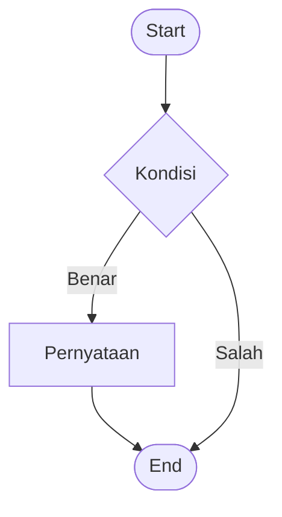

**IF Ganda**

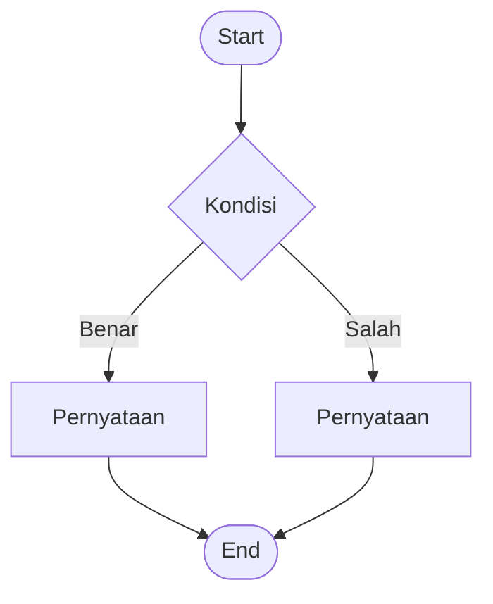

### Pseudocode

**IF Tunggal**

```
IF <kondisi>
  <pernyataan 1>
  <pernyataan 2>
  ..............
  <pernyataan m>
ENDIF
```

**IF Ganda**

```
IF <kondisi>
  <pernyataan 1>
  ..............
  <pernyataan m>
ELSE
  <pernyataan 2>
  ..............
  <pernyataan n>
ENDIF
```


## 10 Logika Percabangan IF Majemuk / IF Bersarang

### Pengertian

* Digunakan jika pemilihan memberikan lebih dari dua alternatif pilihan

### Flowchart

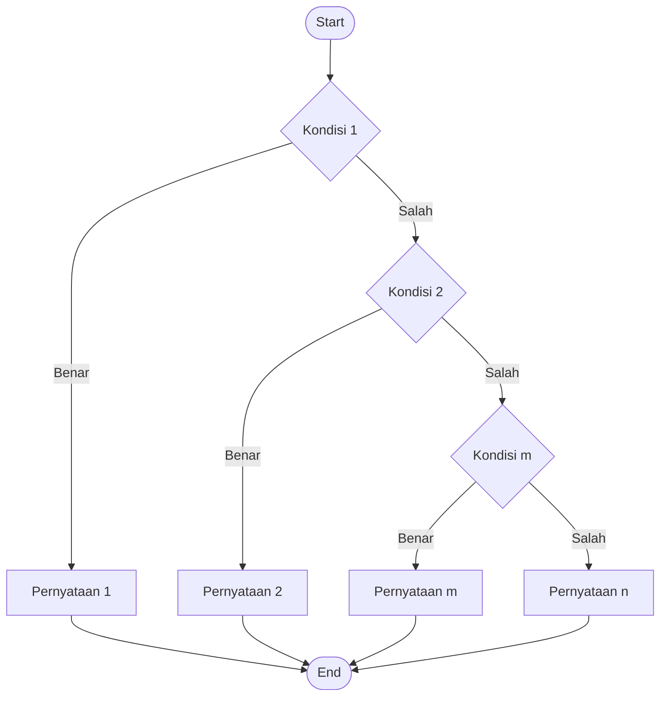

### Pseudocode

```
IF <kondisi 1>
  <pernyataan 1>
  ..............
  <pernyataan m>
ELSE IF <kondisi 2>
  <pernyataan 2>
  ..............
  <pernyataan n>
ELSE IF <kondisi 3>
  <pernyataan 3>
  ..............
  <pernyataan o>
ELSE
  <pernyataan 4>
  ..............
  <pernyataan p>
ENDIF
```


## 11 Logika Percabangan CASE

### Pengertian

* Pengganti IF Majemuk yang apabila dalam suatu masalah IF Majemuk tidak dapat diselesaikan/penyelesaiannya kompleks

### Pseudocode

```
CASE <ekspesi> of
  <kondisi 1> : <pernyataan 1>
  <kondisi 2> : <pernyataan 2>
  <kondisi n> : <pernyataan n>
ELSE
  <pernyataan 4>
ENDCASE
```

### Perbedaan IF VS CASE

| IF                                       | CASE                                        |
|------------------------------------------|---------------------------------------------|
| Kondisi > 1, < 1, >= 1, <= 1, != 1, == 1 | Kondisi == 1                                |
| Kondisi berupa bilangan/string/char      | Kondisi berupa bilangan/string/char/boolean |
| Tidak dapat diganti dengan CASE          | Dapat diganti dengan IF                     |


## 12 Logika Perulangan

### Pengertian

* Adalah suatu bentuk kegiatan mengulang suatu statement sampai batas yang diinginkan

### Flowchart

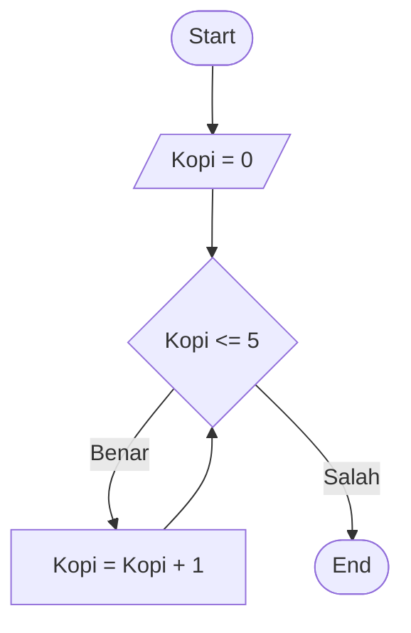

### Jenis Logika Perulangan

1. FOR
1. WHILE
1. DO..WHILE
1. FOREACH


## 13 Logika Perulangan FOR

### Pengertian

* Adalah perulangan yang mana nilai awal, kondisi/nilai akhir, dan step diletakkan secara bersamaan sekaligus ruang lingkup nilai awal, kondisi, step hanya berada di statement for

```java
for (int nilaiAwal = 5; nilaiAwal >= 1; nilaiAwal--) {
  // Aksi yang dilakukan jika for bernilai TRUE
}
```

### Flowchart

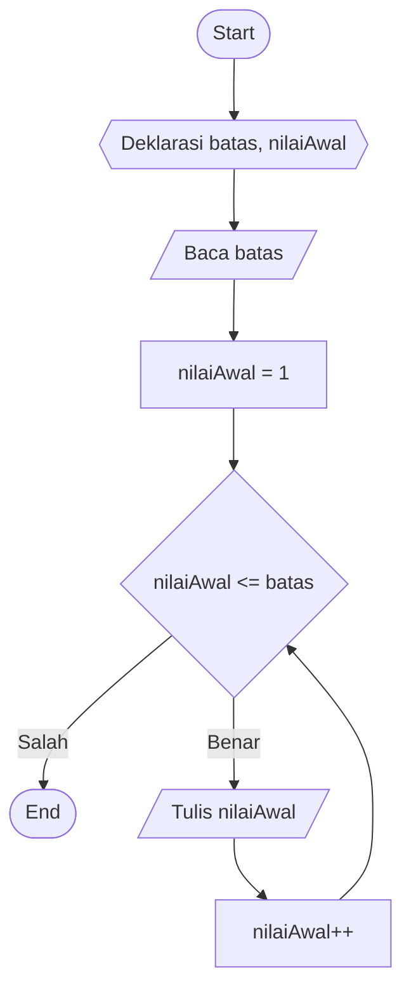

### Pseudocode

```
//DECLARATION
  DECLARE
  INTEGER batas, nilaiAwal

//IMPLEMENTATION
  INPUT(batas)
  SET nilaiAwal = 1

  FOR nilaiAwal TO batas DO
    DISPLAY(nilaiAwal)
  ENDFOR
```


## 14 Logika Perulangan WHILE

### Pengertian

* Adalah perulangan yang mana nilai awal, kondisi/nilai akhir, dan step diletakkan secara prosedural

```java
int batas = 9, nilaiAwal = batas;
while(nilaiAwal >= 1) {
  System.out.println(batas);
  batas--;
}
```

### Flowchart


### Pseudocode

```
//DECLARATION
  DECLARE
  INTEGER batas, nilaiAwal

//IMPLEMENTATION
  INPUT(batas)
  SET nilaiAwal = 1

  WHILE (nilaiAwal <= batas) DO
    DISPLAY(nilaiAwal)
    nilaiAwal++
  ENDWHILE
```


## 15 Logika Perulangan DO..WHILE

### Pengertian

* Adalah perulangan yang aksi dan step dilakukan terlebih dahulu sebelum pengkondisian

```java
int nilaiAwal = 9;
do {
  System.out.println(nilaiAwal);
  nilaiAwal--;
} whiile(nilaiAwal >= 1);
```

### Flowchart

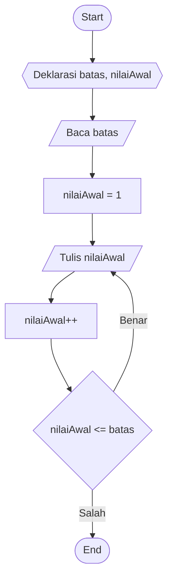

### Pseudocode

```
//DECLARATION
  DECLARE
  INTEGER batas, nilaiAwal

//IMPLEMENTATION/DEFINITION
  INPUT(batas)
  SET nilaiAwal = 1

  DO
    DISPLAY(nilaiAwal)
    SET nilaiAwal++/inc
  ENDDO
  WHILE(nilaiAwal <= batas)
```

### Perbedaan FOR & WHILE vs DO..WHILE

| FOR & WHILE                              | DO..WHILE                              |
|------------------------------------------|----------------------------------------|
| Jika pertama salah, tidak ada perulangan | Jika pertama salah, ada perulangan 1 x |
| Minimal 0 kali perulangan                | Minimal 1 kali perulangan              |


## 16 Membuat Notasi Pola Looping

### Pola 01

```
12345
12345
12345
12345
12345
```

### Flowchart Pola 01

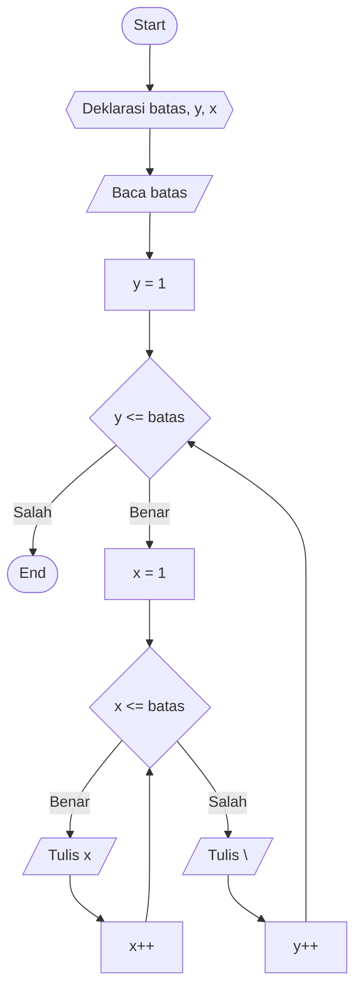

### Pseudocode Pola 01

```
//DECLARATION
  DECLARE
  INTEGER batas, y, x

//IMPLEMENTATION/DEFINITION
  INPUT(batas)
  SET y = 1

  FOR y TO batas DO
    SET x = 1

    WHILE(x <= batas) DO
      DISPLAY(x)
      x++
    ENDWHILE

    DISPLAY("\n")
  ENDFOR
```

### Pola 02

```
12345
1234
123
12
1
```

### Flowchart Pola 02

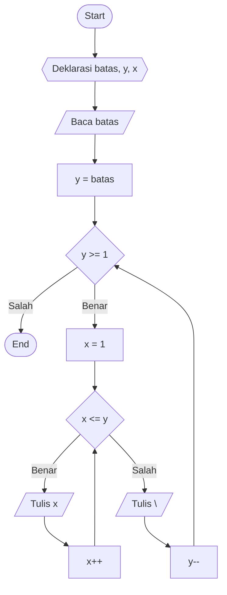

### Pseudocode Pola 02

```
//DECLARATION
  DECLARE
  INTEGER batas, y, x

//IMPLEMENTATION/DEFINITION
  INPUT(batas)
  SET y = batas

  FOR y DOWNTO 1 DO
    SET x = 1

    WHILE(X <= y) DO
      DISPLAY(x)
      X++
    ENDWHILE

    DISPLAY("\n")
  ENDFOR
```


## 17 Logika Array

### Pengertian

* Tipe data yang digunakan untuk mendeskripsikan kumpulan elemen (nilai atau vairabel) yang tiap-tiap elemennya memiliki index
* Sebuah variabel yang dapat menyimpan banyak nilai atau value

### Kenapa Array

1. Manajemen memori
1. Mempermudah pengelolaan data

### Manajemen Memori

```
binatang1 = "Ayam"
binatang2 = "Sapi"
binatang3 = "Kambing"
bintangaN = "..."

binatang = ["Ayam", "Sapi", "Kambing", "..."]
```

### Mempermudah Pengelolaan Data

| Index    | 0      | 1    | 2     | 3       | 4     | 5     |
|----------|--------|------|-------|---------|-------|-------|
| Binatang | Monyet | Sapi | Panda | Pinguin | Koala | Tikus |

### Sifat Array

1. Variabel jamak, dan diacu dengan nama data yang sama
1. Pasangan antara Key dan Value (Key and Value pair)
1. Nilai pada Array boleh memiliki tipe data yang berbeda
1. Array bersarang (Array di dalam Array)


### Flowchart

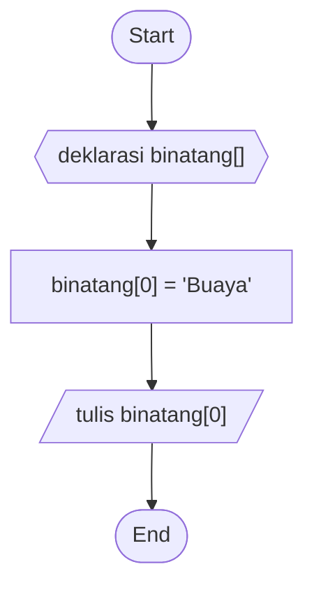

### Pseudocode

```
//DECLARATION
  DECLARE
  ARRAY binatang[] / ARRAY hari[7]

  ARRAY binatang() / ARRAY hari(7)

//IMPLEMENTATION/DEFINITION
  SET binatang[0] = "Buaya"

  DISPLAY(binatang[0])
```

### Perbedaan Array, List, dan Tuple

**Array**

* Kapasitas penyimpanan tetap dengan tipe data yang sama
* Ketika tidak diisikan value pada saat deklarasi, maka akan otomatis terisi dengan nilai default tipe data
* Value pada array bisa diubah namun tetap bertipe data sama
* Tidak bisa menambah value karena kapasitas penyimpanan tetap saat deklarasi

**List**

* Kapasitas penyimpanan dinamis dengan tipe data bisa berbeda
* Ketika tidak diisi value pada saat deklarasi, maka value dari list memang masih kosong
* Opsi lebih banyak:
  * Bisa menambah value baru dengan tipe data berbeda
  * Menghapus value
  * Mengubah value dnegan tipe data berbeda

**Tuple**

* Kapasitas penyimpanan tetap dengan tipe data bisa berbeda
* Kapasitas tidak diisi value pada saat deklarasi, maka kapasitas value pada tupe akan tetap 0
* Kapasitas value pada tupe tergantung kita mengisi value pada saat deklarasi
* Opsi pada tupe hanya dapat mengubah value dengna tipe data berbeda

> NOTE: dalam bahasa pemrograman tertentu (seperti: Python), terdapat fungsi untuk mengkonversi list menjadi tuple dan sebaliknya

### Kelebihan dan Kekurangan?

**Array**

* Kelebihan:
  * Sangat cocok untuk pengaksesan data acak, karena elemen pada array dapat diacu secara langsung tanpa melalui elemen lainnya
  * Penggunaan memori stabil karena data yang statis
* Kekurangan:
  * Tidak efektif dalam penggunaan memori
  * Menyisakan banyak waktu komputasi
  * Representasi status tidak dimungkinkan dalam satu aplikasi

**List**

* Kelebihan:
  * Lebih efisien dalam penggunaan memori
  * Sangat cocok untuk representasi data di sebuah aplikasi (terutama bila menarik data dari database)
* Kekurangan:
  * Program semakin lambat dan memori semakin tersita banyak seiring dengan data yang terus bertambah


## 18 Logika Function

### Pengertian

* Suatu program terpisah dalam bloks sendiri yang berfungsi sebagai sub program
* Fungsi mempunyai nilai kembalian atau return value dari tipe tertentu
* Program kecil dalama bahasa pemrograman
* Bisa memiliki input (argumen) dan bisa menghasilkan output (pengembalian nilai)
* Output dari function bisa menjadi input dari function lainnya
* Bagian terpenting dalam pemrograman walaupun sifatnya sebagai sub program
* Sebelum menggunakan function, pastikan function sudah tersedia (sudah dibuat)

### Kenapa Function?

* Dapat digunakan lebih dari satu kali (Reusability)
* Manajemen memori
* Keefektifan kode program
* Lebih mudah dipahami oleh kita dan programmer lain

### Kategori Function

* Build-in Function
  * Function yang sudah disediakan Bahasa pemrograman
  * Kita tinggal memanggil atau menggunakan saja
* User Defined Function
  * Function yang dibuat sendiri

### Pseudocode

```
//WRITE FUNCTION (User Defined Function)
  FUNCTION nameFunction
    ...
    ...
  ENDFUNCTION

//CALL FUNCTION
  CALL:nameFunction
```

### Flowchart

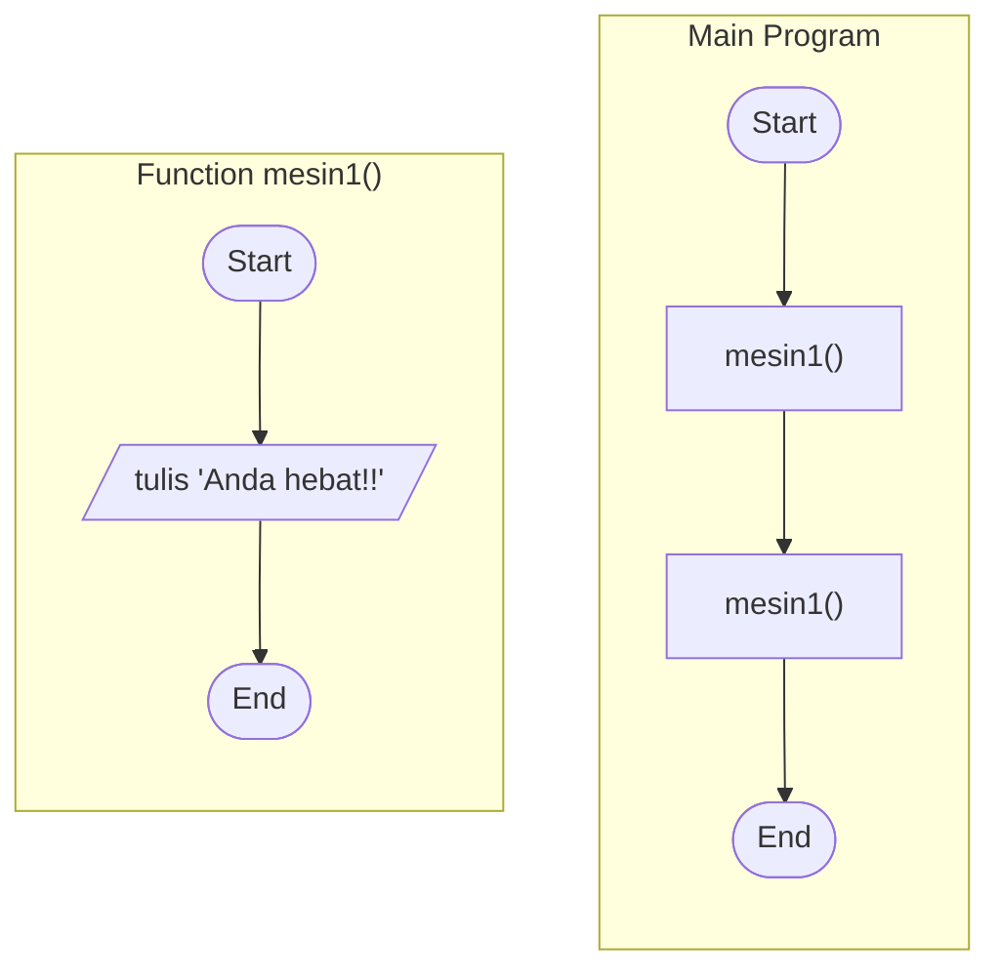


## 19 Konsep Argument & Parameter pada Function

### Pengertian

* Parameter, adalah variabel yang ditulid di dalam kurung pada saat function dibuat, digunakan untuk menampung nilai yang dipanggil saat functoin dipanggil
* Argument, adalah nilai yang dikirimkan ke parameter saat function dipanggil

### Pseudocode

```
//DECLARATION
  DECLARE
  INTEGER x, y

//WRITE FUNCTION (User Defined Function)
  FUNCTION name(x, y)
    RETURN x * y
  ENDFUNCTION

//CALL FUNCTION
  CALL:name(10, 2)
  DISPLAY(call:name(10, 2))
```

### Flowchart

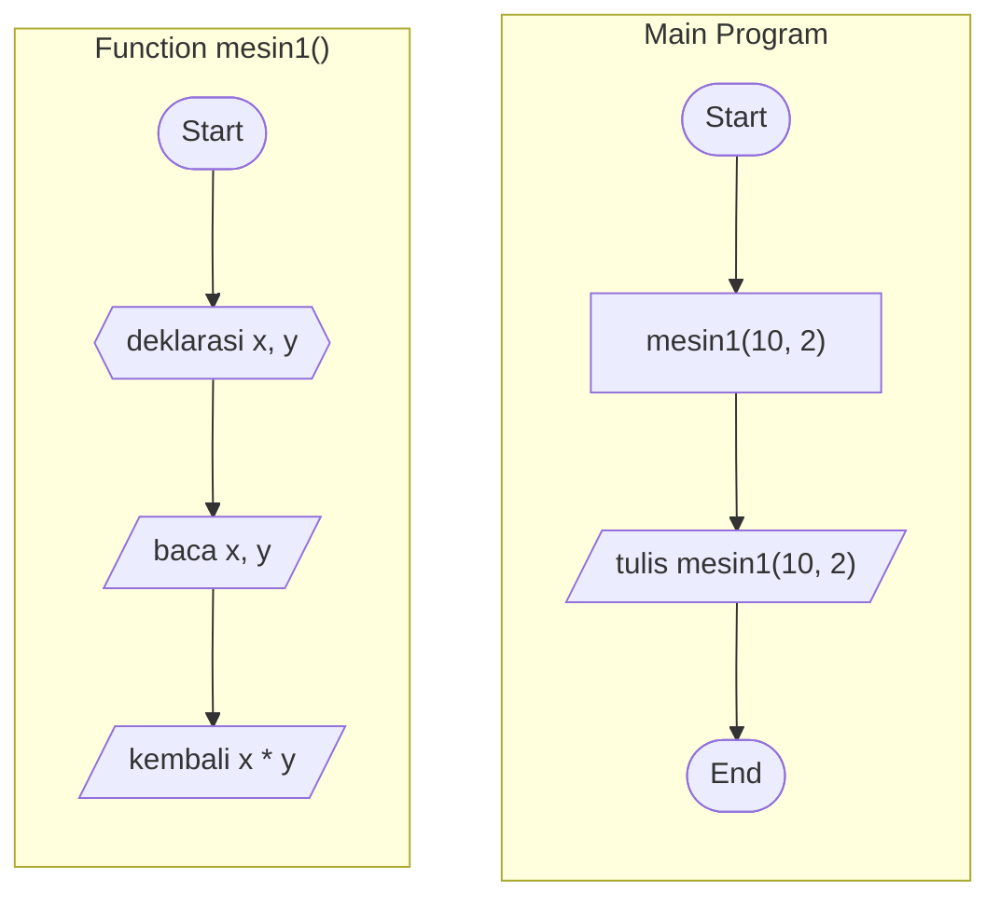

### Pertanyaan?

1. Bagaimana jika Argument > Parameter ?
1. Bagaimana jika Parameter > Argument ?
1. Bagaimana jika Argument != tipe data Parameter ?
