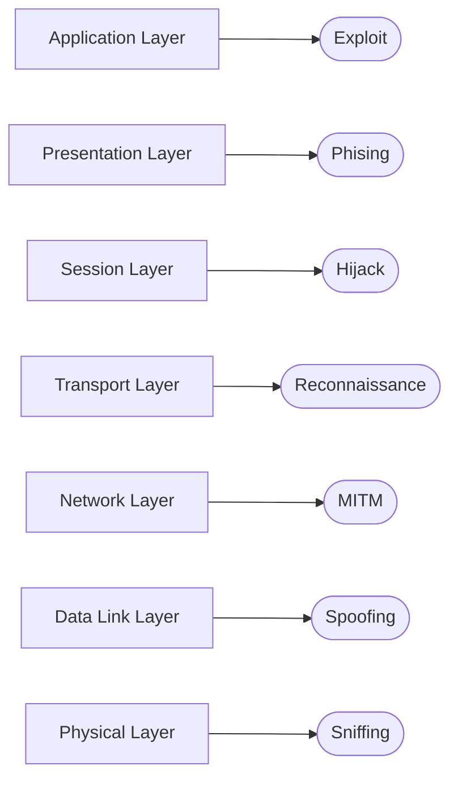

# 20250323051218 OSI Layers & Cyber Attacks

#CyberSec

Understanding cyber attacks across OSI layers.

```mermaid
flowchart LR

  A[Application Layer] --> AA([Exploit])
  B[Presentation Layer] --> BB([Phising])
  C[Session Layer] --> CC([Hijack])
  D[Transport Layer] --> DD([Reconnaissance])
  E[Network Layer] --> EE([MITM])
  F[Data Link Layer] --> FF([Spoofing])
  G[Physical Layer] --> GG([Sniffing])
```
